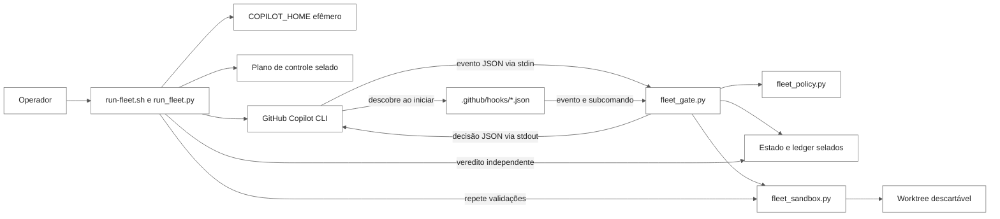
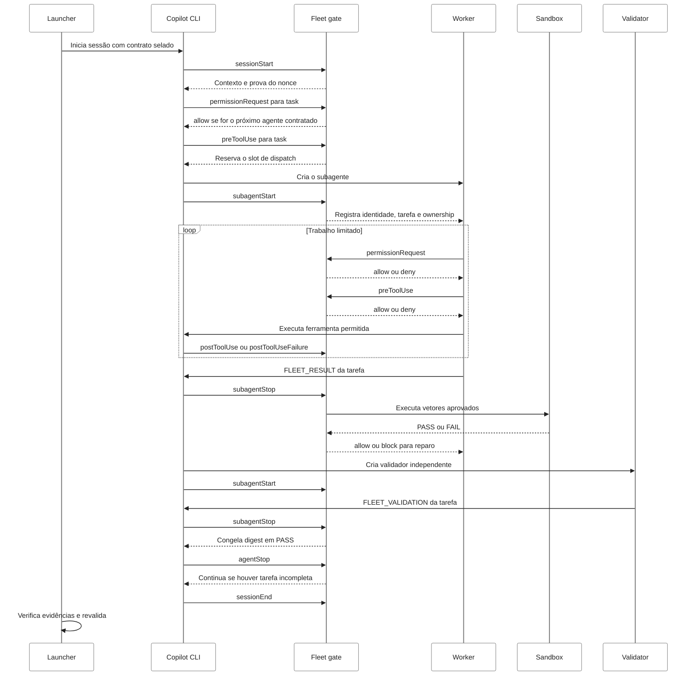

# Hooks do GitHub Copilot no Open Horizons

Este guia explica o que são hooks, onde eles entram no ciclo de vida de uma
sessão, como o harness os integra e como os quatro descritores deste projeto
governam agentes e ferramentas.

O foco aqui são os **hooks do GitHub Copilot**, não Git hooks como
`pre-commit`, nem webhooks HTTP de GitHub, Backstage ou Kubernetes.

## A ideia em um minuto

Um hook é um programa externo chamado automaticamente pelo runtime do Copilot
em um ponto conhecido do ciclo de vida. Ele recebe um evento em JSON pela
entrada padrão e pode devolver uma decisão ou contexto em JSON pela saída
padrão.

Pense no harness como um aeroporto:

| Peça real | Analogia | Responsabilidade |
| --- | --- | --- |
| `run_fleet.py` | Central de operações | Prepara a execução e inicia o Copilot |
| `.github/hooks/*.json` | Escala dos fiscais | Diz em quais momentos cada fiscalização acontece |
| `fleet_gate.py` | Fiscal do portão | Recebe o evento e decide permitir, negar ou pedir correção |
| `fleet_policy.py` | Regulamento do aeroporto | Contém as regras compartilhadas e verificações criptográficas |
| Contrato selado | Cartão de embarque inviolável | Define agente, tarefa, áreas permitidas e validações |
| Ledger selado | Caixa-preta | Registra evidências mínimas e resistentes a adulteração |
| `fleet_sandbox.py` | Área isolada de inspeção | Executa validações sem credenciais e sem acesso de escrita externo |
| `harness/hooks.py` | Painel de status | Relata configuração e cobertura, mas não dispara hooks |

O ponto mais importante é este:

> O launcher inicia a viagem, mas é o runtime do Copilot que chama cada hook
> quando um evento acontece.

Sem um contrato de fleet ativo, os mesmos descritores são carregados, mas o
`fleet_gate.py` retorna uma decisão vazia e permanece inerte. Assim, uma sessão
interativa comum não herda por acidente o contrato de outra execução.

## Mapa da arquitetura



Há três planos que não devem ser confundidos:

1. **Plano de descrição:** os quatro arquivos JSON ligam eventos a comandos.
2. **Plano de decisão:** `fleet_gate.py` e `fleet_policy.py` decidem o que é
   permitido para a tarefa e para o agente ativos.
3. **Plano de execução confiável:** `fleet_sandbox.py` executa somente vetores
   de validação aprovados dentro de contenção comprovada.

## Onde os hooks entram

O Copilot procura hooks de repositório em `.github/hooks/*.json`. Fontes de
política, usuário, repositório, configurações e plugins podem coexistir. Os
hooks correspondentes são combinados; um arquivo não substitui silenciosamente
os demais.

Para os hooks deste repositório serem executados:

- a pasta precisa ser confiável para o Copilot CLI;
- `disableAllHooks` não pode estar ativo em uma camada efetiva;
- o JSON precisa usar a versão `1` e declarar eventos válidos;
- o comando precisa existir e ser executável;
- caminhos relativos e `cwd` são resolvidos a partir da raiz do workspace;
- alterações na configuração são carregadas em uma nova inicialização da CLI.

O launcher evita depender da configuração pessoal da máquina. Ele cria um
`COPILOT_HOME` efêmero fora do repositório, registra somente este checkout como
confiável, ativa hooks e limita a execução a um subagente por vez, com
profundidade máxima de um.

## Quem invoca quem

O fluxo real é:

1. `run-fleet.sh` chama `scripts/run_fleet.py`.
2. O launcher verifica limpeza do repositório, memória e contrato de execução.
3. O launcher cria um diretório de controle `0700` fora do repositório.
4. O launcher gera uma chave por execução e sela contrato, estado inicial,
   baseline e início do ledger.
5. O launcher cria um `COPILOT_HOME` isolado e valida os descritores.
6. Uma prova ativa confirma que os hooks foram realmente carregados e que a
   contenção esperada está operante.
7. O launcher inicia `copilot` com o agente orquestrador, o caminho do contrato
   e a chave apenas no ambiente do processo autorizado.
8. A CLI descobre os quatro JSON e chama `fleet_gate.py` quando os eventos
   acontecem.
9. O gate atualiza estado e evidências, e devolve decisões à CLI.
10. Ao final, o launcher não confia no texto do modelo: ele verifica estado,
    ledger, digests, baseline e repete as validações aprovadas.

O launcher e o hook importam a mesma política e o mesmo sandbox. Isso evita
duas definições diferentes de segurança, uma para quem executa e outra para
quem verifica.

### O que o harness não faz

O módulo [`harness/hooks.py`](../../harness/hooks.py) é uma fachada de consulta.
Ele:

- lista os descritores encontrados;
- informa se existe um contrato configurado e se ele foi verificado;
- mostra os eventos governados pelo dispatcher real;
- relata se o diretório de controle está fora do repositório;
- expõe verificações de ownership, contenção de caminho e limpeza de ambiente.

Ele **não** inicia o Copilot, **não** simula eventos e **não** reimplementa a
política. O launcher operacional é
[`scripts/run_fleet.py`](../../scripts/run_fleet.py), e o emissor dos eventos é
o runtime do Copilot.

## O contrato de entrada e saída

Para um hook de comando, a CLI escreve um objeto JSON em `stdin`. Um evento de
ferramenta se parece conceitualmente com:

```json
{
  "sessionId": "sessao-123",
  "cwd": "/workspace/open-horizons",
  "toolName": "edit",
  "toolArgs": {
    "path": "docs/guia.md"
  }
}
```

Uma negação de `preToolUse` usa:

```json
{
  "permissionDecision": "deny",
  "permissionDecisionReason": "write destination is outside the active task's ownership"
}
```

Uma autorização explícita em `permissionRequest` usa outro schema:

```json
{
  "behavior": "allow"
}
```

E um stop hook pode pedir mais uma rodada ao mesmo agente:

```json
{
  "decision": "block",
  "reason": "Repair the task and return the exact result marker again."
}
```

Essa diferença de schemas é uma das razões para centralizar a tradução no
`fleet_gate.py`, em vez de espalhar pequenos scripts independentes.

### Códigos de saída e timeout

| Resultado do processo | Comportamento geral da CLI |
| --- | --- |
| `0` | Sucesso; a CLI interpreta o JSON de `stdout`, quando presente |
| `2` | Nega em `preToolUse` e `permissionRequest`; em `postToolUseFailure`, o texto vira contexto adicional |
| Outro não zero | Normalmente é registrado e ignorado; `preToolUse` é a exceção fail-closed |
| Timeout | Sempre fail-open no runtime, inclusive em `preToolUse` |

Um timeout fail-open é uma restrição importante da plataforma. Este projeto não
tenta transformá-lo em algo que ele não é. Em vez disso:

- remove ferramentas de comando da capacidade do subagente;
- aplica `--excluded-tools` e `--deny-tool` no launcher;
- usa `permissionRequest` e `preToolUse` como verificações independentes;
- dá ao handler um orçamento interno menor que `timeoutSec`;
- executa validações somente no sandbox confiável;
- deixa o launcher decidir o resultado final com evidência selada.

## Linha do tempo de uma tarefa



## Os quatro descritores deste projeto

Todos os descritores chamam o mesmo entry point. O argumento passado ao script
seleciona o handler interno:

```text
GitHub Copilot event
        |
        v
.github/hooks/<descritor>.json
        |
        v
python3 .github/hooks/scripts/fleet_gate.py <evento-interno>
```

| Descritor | Eventos | Timeout | Papel |
| --- | --- | ---: | --- |
| [`10-guardrails.json`](10-guardrails.json) | `preToolUse`, `postToolUse`, `postToolUseFailure` | 10 s | Fiscaliza ferramentas e registra resultados |
| [`20-task-contract.json`](20-task-contract.json) | `sessionStart`, `subagentStart` | 10 s | Ativa contrato e registra identidade |
| [`30-validation-gate.json`](30-validation-gate.json) | `subagentStop`, `agentStop`, `sessionEnd` | 900/10/10 s | Valida, controla conclusão e fecha a execução |
| [`40-mcp-gate.json`](40-mcp-gate.json) | `permissionRequest`, `preMcpToolCall` | 10 s | Decide permissões e bloqueia MCP por padrão |

Os números iniciais tornam o inventário legível e estável. A política, porém,
não deve depender apenas da ordem nominal: todas as entradas correspondentes a
um evento podem ser executadas.

### `10-guardrails.json`: fiscalização de ferramentas

#### `preToolUse`

É chamado imediatamente antes de uma ferramenta executar. O gate:

1. normaliza nomes de ferramentas entre formatos Copilot, VS Code e Claude;
2. exige argumentos em um formato revisável;
3. verifica se o plano de controle já entrou em estado de aborto;
4. nega toda a família de shell, sessões assíncronas e agent messaging;
5. nega ferramentas MCP e argumentos com formato de comando;
6. para um dispatch, aceita somente o próximo agente previsto pelo contrato;
7. para uma escrita, extrai todos os destinos, inclusive `Move to:` e
   `Rename to:` de patches;
8. nega escapes do repositório, subárvores protegidas e caminhos fora do
   ownership da tarefa ativa;
9. reserva serialmente o slot do próximo subagente quando o dispatch é válido;
10. registra a negação em evidência selada.

Subárvores permanentemente protegidas incluem:

- `.git/`;
- `.github/hooks/`;
- `.test-results/`;
- o diretório externo do plano de controle.

Se não há subagente registrado, o escopo de escrita é vazio. Não existe um
fallback que una os caminhos de todas as tarefas.

#### `postToolUse`

É chamado depois de uma ferramenta terminar com sucesso. O projeto registra no
ledger apenas metadados sanitizados, como nome da ferramenta e resultado
`PASS`. O resultado bruto da ferramenta não é copiado para a evidência.

#### `postToolUseFailure`

É chamado quando a ferramenta falha. O gate registra `FAIL` e devolve uma
orientação curta para o agente reparar a mesma tarefa limitada.

Este caso tem tratamento especial: o script escreve texto simples em `stdout`
e termina com código `2`, porque é assim que a CLI anexa `additionalContext` a
esse evento.

### `20-task-contract.json`: abertura e identidade

#### `sessionStart`

É a abertura da sessão. O handler:

- registra data e contagem de inicializações;
- limpa slots antigos na primeira entrega;
- tolera de forma limitada uma entrega duplicada medida em versões da CLI;
- copia para o ledger o nonce criado pelo launcher;
- registra hash do contrato, modo e propósito;
- injeta contexto informando que `CONFINED_LITE` está ativo.

O nonce não aparece no prompt do modelo. O launcher conhece o valor esperado e
só aceita uma evidência selada produzida por um hook realmente executado.

#### `subagentStart`

É chamado antes de um subagente trabalhar. Esse evento não bloqueia a criação
diretamente, então o projeto usa uma **quarentena efetiva**:

- o nome deve corresponder ao dispatch pendente;
- somente um subagente pode ocupar o slot ativo;
- quando há identificador de runtime, ele é associado ao slot;
- identidade inesperada ou concorrente recebe contexto de quarentena;
- uma identidade em quarentena tem ownership vazio e não pode escrever;
- tarefas já aprovadas têm seu digest revisto para detectar mutação posterior.

Para um worker válido, o contexto inclui a tarefa, os caminhos permitidos e o
marcador final exigido:

```text
FLEET_RESULT: TNNN-NNN: PASS|FAIL|BLOCKED
```

Para um validador, o contexto reforça que ele é somente leitura e exige:

```text
FLEET_VALIDATION: TNNN-NNN: PASS|FAIL
```

### `30-validation-gate.json`: conclusão com evidência

#### `subagentStop`

É o hook mais trabalhoso e, por isso, tem `timeoutSec: 900`. Ele correlaciona o
stop com o slot ativo antes de liberá-lo. Um stop antigo ou de outra identidade
não pode encerrar a tarefa corrente.

Para um worker, o handler:

1. exige exatamente um marcador `FLEET_RESULT` para a tarefa correta;
2. exige detalhe concreto quando o resultado é `FAIL` ou `BLOCKED`;
3. verifica binding do repositório e mudanças fora do ownership;
4. marca a validação como `IN_FLIGHT` antes de iniciar subprocessos;
5. calcula o digest anterior dos caminhos da tarefa;
6. executa os vetores determinísticos no sandbox;
7. calcula novamente o digest e detecta mudanças concorrentes;
8. repete a busca por mudanças fora de escopo;
9. pede uma rodada de reparo quando ainda existe orçamento;
10. registra `PASS`, `FAIL` ou `BLOCKED` no estado selado.

Para um validador, o handler:

- recusa aprovação antes da validação determinística;
- exige o marcador `FLEET_VALIDATION` da tarefa correta;
- confirma que o conteúdo não mudou desde o worker;
- mantém o validador somente leitura;
- congela o digest quando a revisão independente passa;
- devolve a tarefa ao worker quando a revisão falha e ainda há orçamento.

Um `decision: "block"` não significa falha do processo do hook. Significa
“ainda não encerre este subagente; faça mais uma rodada com esta orientação”.
O contador do projeto termina antes do limite de oito continuações da CLI.

#### `agentStop`

É chamado quando o agente principal tenta terminar o turno. Ele:

- encerra com `BLOCKED` se o plano de controle foi adulterado ou abortado;
- detecta mudanças em tarefas cujo digest já estava congelado;
- pede continuação enquanto houver tarefas sem resultado terminal;
- evita loops quando `stopHookActive` informa que a CLI já forçou continuação;
- registra o resultado agregado somente quando a execução está completa.

Ausência de evidência nunca é interpretada como `PASS`; o padrão é
`BLOCKED`.

#### `sessionEnd`

Registra o motivo normalizado de encerramento, como `complete`, `error`,
`abort`, `timeout` ou `user_exit`. Ele fecha a trilha, mas não decide sozinho o
resultado da fleet.

### `40-mcp-gate.json`: permissão e MCP

#### `permissionRequest`

É chamado antes do serviço normal de permissões da CLI. Em execução
não interativa, deixar a decisão “cair adiante” pode terminar em uma negação
pouco explicativa. Por isso, o gate decide explicitamente:

- permite leituras conhecidas e escritas que passaram por toda a política;
- permite o dispatch correto sem reservar o slot nesta etapa;
- nega shell, MCP, ferramentas desconhecidas e escritas fora de ownership;
- nega se os argumentos não puderem ser revisados;
- registra decisões negativas no ledger.

O dispatch só reserva o slot em `preToolUse`. Assim, uma solicitação de
permissão que nunca chegar à execução não deixa uma reserva fantasma.

#### `preMcpToolCall`

É chamado antes de uma ferramenta MCP. No perfil `CONFINED_LITE`, todas as
chamadas MCP são negadas por padrão e recebem o reason code
`mcp-tool-denied`.

Isso não afirma que MCP seja inseguro em geral. Significa que esta modalidade
de execução não concede a subagentes um canal externo cuja identidade,
credencial e efeitos não façam parte do contrato selado.

## Os três scripts do gate

### `fleet_gate.py`: o controlador de tráfego

[`scripts/fleet_gate.py`](scripts/fleet_gate.py) é o único entry point dos
quatro descritores. Ele:

- lê e normaliza payloads;
- carrega e verifica o contrato;
- despacha o evento para um handler;
- mantém o slot serial de subagente;
- aplica ownership e transições da tarefa;
- produz decisões no schema esperado pela CLI;
- registra evidência sanitizada;
- converte exceções em respostas fail-closed quando o evento permite decisão.

Sem `OPEN_HORIZONS_FLEET_HOOK_CONTRACT`, `load_contract()` retorna `None` e o
entry point devolve `{}`. Esse é o modo inerte intencional.

### `fleet_policy.py`: o regulamento comum

[`scripts/fleet_policy.py`](scripts/fleet_policy.py) é importado tanto pelo
gate quanto pelo launcher. Ele concentra:

- constantes de modo, eventos e limites;
- HMAC de contrato e estado;
- ledger encadeado e head selado;
- lock interprocesso;
- comparação segura de caminhos e ownership;
- digests de árvores e binding do repositório;
- limpeza de ambiente;
- lista de capacidades removidas;
- política de vetores de validação em formato `argv`.

A expressão regular de comandos proibidos é apenas um alarme adicional. A
fronteira real é a remoção da capacidade de shell, combinada com contrato,
ownership, sandbox e veredito independente.

### `fleet_sandbox.py`: o laboratório isolado

[`scripts/fleet_sandbox.py`](scripts/fleet_sandbox.py) é o único local onde o
gate e o launcher podem executar vetores de validação. Ele combina:

1. **Worktree descartável:** checkout destacado em `base_head`, recebendo
   somente os caminhos da tarefa e de suas dependências autorizadas.
2. **Sandbox do sistema operacional:** Seatbelt no macOS ou `bwrap` no Linux.
3. **Ambiente sem segredos:** `HOME` e temporários próprios, sem chave do run,
   tokens GitHub/Copilot ou credenciais de nuvem.

O backend é testado antes do uso. A prova precisa mostrar que ele permite
escrita dentro do workspace, nega escrita fora e nega conexão loopback. Se
essa contenção não puder ser comprovada, não existe fallback sem sandbox: a
validação termina em `BLOCKED`.

## O plano de controle selado

O plano de controle fica fora do repositório, normalmente sob o diretório de
estado do usuário. A separação impede que uma tarefa “corrija a própria prova”
editando o lugar onde o resultado é guardado.

| Artefato | Função |
| --- | --- |
| `hook-contract.json` | Contrato schema v2, selado com HMAC |
| `hook-state.json` | Estado de tarefas, slots, tentativas e resultados |
| `hook-evidence.jsonl` | Ledger de eventos sanitizados e encadeados |
| `hook-ledger-head.json` | Contagem e digest terminal para detectar truncamento |
| `hook-baseline-tree.json` | Snapshot do repositório antes da sessão |
| `hook-control.lock` | Exclusão mútua entre processos de hook |
| `abort` | Marcador terminal de perda de confiança |
| `scratch/` | Temporários do launcher, não o workspace de validação |

A chave é criada para uma execução, passada apenas ao processo autorizado e
nunca persistida em disco, contexto do modelo ou ledger. Registros de evidência
aceitam apenas um vocabulário fechado de metadados. Prompt, resposta do modelo,
argumentos brutos, caminhos e segredos não são copiados para o ledger.

## Canary, liveness e veredito

Três perguntas diferentes precisam de respostas diferentes:

1. **Os arquivos parecem corretos?** A verificação estática confere inventário,
   eventos, comandos, permissões dos scripts e configurações efetivas.
2. **Os hooks realmente foram carregados nesta execução?** Uma sessão de
   liveness precisa produzir um `sessionStart` selado com o nonce do launcher.
3. **A contenção realmente impede uma escrita fora do ownership?** O canary
   executa uma tarefa neutra e exige evidência selada de uma escrita permitida
   dentro do escopo e uma escrita negada fora dele.

Uma atestação de contenção só pode ser reutilizada enquanto continuar vinculada
à versão da CLI e aos hashes dos artefatos relevantes. A prova de liveness é
por execução.

O resultado escrito pelo modelo, o código de saída da sessão e os arquivos em
`.test-results/` não são fontes de veredito. O launcher verifica o plano de
controle e repete os vetores aprovados antes de decidir `PASS`.

## Como criar comportamento específico por tipo de agente

Um arquivo `.agent.md` e um arquivo de hooks resolvem problemas diferentes:

- o perfil do agente descreve papel, instruções e ferramentas disponíveis;
- o descritor de hook escolhe eventos do runtime;
- o contrato decide qual tarefa pertence a qual agente e qual é seu escopo;
- o gate relaciona a identidade ativa com esse contrato.

Não existe um campo `hooks:` no perfil de agente que torne automaticamente um
descritor privado daquele agente. Por padrão, hooks de repositório são globais
para as sessões que os carregam.

### Opção 1: `matcher` em um evento compatível

O evento `subagentStart` aceita um `matcher` aplicado ao `agentName`. Em um
harness genérico, um contexto específico para Terraform poderia ser ligado
assim:

```json
{
  "version": 1,
  "hooks": {
    "subagentStart": [
      {
        "type": "command",
        "matcher": "^open-horizons-terraform$",
        "exec": "python3",
        "args": [".github/hooks/scripts/terraform-context.py"],
        "cwd": ".",
        "timeoutSec": 10
      }
    ]
  }
}
```

Use `matcher` para seleção simples no evento que oferece a identidade. Em
`preToolUse`, o matcher filtra pelo **nome da ferramenta**, não pelo agente.
Além disso, eventos de ferramenta não devem ser tratados como se sempre
carregassem `agentName`.

Neste repositório, não adicione esse exemplo literalmente. O inventário de
descritores e o handler são intencionalmente exatos; um novo arquivo ou script
exige atualização coordenada do validator, dos pins de integridade, dos testes
e da projeção Claude.

### Opção 2: limitar ferramentas no perfil do agente

O frontmatter de `.github/agents/*.agent.md` pode expor somente as ferramentas
necessárias. Um agente de revisão, por exemplo, pode receber apenas leitura e
busca.

Essa é uma boa redução de superfície, mas não é a única fronteira de segurança:
aliases, ferramentas novas e diferenças entre runtimes existem. O gate ainda
precisa validar intenção, destino e estado.

### Opção 3: política orientada pelo contrato, usada aqui

O padrão preferido do Open Horizons associa a política à tarefa:

O trecho a seguir é conceitual. Em uma execução real, o manifesto completo e
cada vetor de validação também precisam ser aceitos pela allowlist e pelo hash
do contrato aprovado em `run_fleet.py`.

```json
{
  "id": "T999-001",
  "agent": "open-horizons-terraform",
  "validator_agent": "open-horizons-security-reviewer",
  "depends_on": [],
  "read_only": false,
  "owned_paths": [
    "terraform/modules/example"
  ],
  "validation_commands": [
    ["terraform", "-chdir=terraform/modules/example", "validate"]
  ]
}
```

O fluxo fica assim:

1. o launcher transforma o manifesto aprovado em contrato selado;
2. `preToolUse` aceita somente o próximo dispatch previsto;
3. `subagentStart` registra a identidade no slot ativo;
4. cada escrita consulta os `owned_paths` dessa tarefa;
5. um `read_only: true` nunca recebe escopo de escrita;
6. o worker e o validator seguem transições diferentes no mesmo handler;
7. os vetores são validados por política antes de qualquer subprocesso.

Esse modelo permite que dois usos do mesmo agente tenham permissões diferentes
sem duplicar descritores. O escopo acompanha a tarefa, não apenas o nome do
agente.

### Por que o agente `general-purpose` não serve para a fleet

O agente interno `general-purpose` não emite os eventos de ciclo de vida de
subagente necessários para registrar e liberar o slot. Por isso, o gate só
aceita agentes customizados previstos pelo contrato e recusa dispatches não
registrados.

## Um exemplo narrado

Imagine que a tarefa `T999-001` pertence ao `open-horizons-engineer`, possui
um conjunto delimitado de entradas em `owned_paths` e será revista pelo
`open-horizons-security-reviewer`.

1. O orquestrador pede o dispatch do engineer.
2. `permissionRequest` confirma que ele é o próximo agente contratado.
3. `preToolUse` repete a decisão e reserva o portão de embarque.
4. `subagentStart` confere o nome e entrega o cartão de embarque da tarefa.
5. Uma edição dentro de `owned_paths` passa pelas duas catracas.
6. Uma tentativa em outro arquivo recebe `write-outside-ownership`.
7. O worker termina com `FLEET_RESULT: T999-001: PASS`.
8. `subagentStop` leva a entrega ao laboratório isolado e roda os testes.
9. Se falharem, o mesmo worker recebe uma rodada limitada de reparo.
10. Se passarem, o validador entra somente para leitura.
11. O validador retorna `FLEET_VALIDATION: T999-001: PASS`.
12. O gate congela o digest. Qualquer mudança posterior bloqueia a execução.
13. O launcher abre a caixa-preta, repete as validações e decide o resultado.

O agente pode propor o resultado, mas não pode carimbar o próprio passaporte.

## Defesa em camadas

| Camada | Pergunta respondida |
| --- | --- |
| `tools:` do agente | A ferramenta deveria estar visível para este papel? |
| Flags da CLI | Esta capacidade deve existir nesta sessão? |
| `permissionRequest` | A permissão deve ser concedida antes do fluxo normal? |
| `preToolUse` | Esta chamada concreta pode executar agora? |
| Contrato e estado | Este agente é o agente certo para a tarefa certa? |
| Ownership | Este destino pertence à tarefa ativa? |
| Sandbox | A validação pode rodar sem alcançar o host ou credenciais? |
| Ledger e digests | A evidência foi alterada ou o conteúdo mudou? |
| Revalidação do launcher | O resultado continua válido fora da narrativa do modelo? |

Nenhuma camada isolada responde a tudo.

## Mitos rápidos

### “O JSON contém a política”

Não. O JSON é o quadro de horários. A política está nos scripts chamados por
ele e no contrato ativo.

### “O harness chama `preToolUse` diretamente”

Não durante a sessão real. A CLI chama o hook quando a ferramenta chega ao
ponto de execução. Testes unitários podem chamar handlers diretamente.

### “Um exit code `0` significa sempre permitir”

Não. Significa que o processo terminou corretamente; o JSON de saída contém a
decisão. Uma saída `{}` normalmente deixa o fluxo seguir para a próxima camada.

### “Um timeout bloqueia por segurança”

Não. Timeouts de hook são fail-open na CLI. Por isso a segurança deste projeto
não depende de um único hook terminar a tempo.

### “Se o modelo escreveu PASS, a tarefa passou”

Não. O texto é apenas uma solicitação de conclusão. Gate e launcher verificam
as provas.

### “Basta criar um JSON por agente”

Não necessariamente. Todos os descritores aplicáveis são combinados. Use
`matcher` onde a identidade está disponível ou, preferencialmente neste
projeto, relacione agente e tarefa no contrato selado.

## Portabilidade para Claude Code

A superfície canônica permanece em `.github/`. O script
[`generate-claude-harness.py`](../../scripts/generate-claude-harness.py)
projeta agentes, regras, skills, comandos, MCP e configurações para `.claude/`.

Claude Code usa nomes de eventos e schemas diferentes. O adaptador
[`claude_gate.py`](../../.claude/hooks/claude_gate.py):

- traduz eventos PascalCase para os eventos internos do gate;
- traduz aliases como `Read`, `Write`, `Bash` e `Task`;
- converte as respostas para o schema de hooks do Claude;
- trata uma ferramenta `mcp__*` como `mcp-tool-call`;
- importa o mesmo `fleet_gate.py`, sem copiar a política.

A projeção fica inerte sem contrato selado e falha de forma fechada quando a
entrada ou o plano de controle não podem ser resolvidos.

## Como verificar

### Validação estática dos descritores

```bash
python3 scripts/verify-hooks-loaded.py
python3 scripts/validate-copilot-primitives.py --strict
```

O primeiro comando confere inventário exato, eventos, handler, bit executável e
configuração de hooks. A prova autoritativa de execução continua sendo a
evidência selada com nonce, produzida por uma sessão real.

### Testes focados

```bash
python3 -m pytest tests/test_fleet_hooks.py tests/test_verify_hooks_loaded.py -q
```

Esses testes cobrem, entre outros casos:

- contrato, estado ou ledger adulterado;
- escrita sem identidade registrada;
- escrita fora de ownership;
- tarefa somente leitura;
- dispatch fora de ordem ou concorrente;
- stop antigo tentando liberar o slot atual;
- patch com destino de rename ou move;
- MCP e ferramentas desconhecidas;
- sandbox ausente;
- mutação durante ou depois da validação;
- orçamento limitado de continuação.

### Projeção Claude

```bash
python3 scripts/generate-claude-harness.py --check
```

### Planejamento sem lançar agentes

```bash
./scripts/run-fleet.sh --wave 1 --dry-run
```

O dry run valida e mostra o plano sem exigir uma execução viva da fleet.

## Checklist para alterar um hook

- Defina o evento correto e confirme o schema de entrada e saída.
- Decida se o hook observa, injeta contexto, modifica ou bloqueia.
- Trate payload desconhecido como não revisável quando houver efeito de escrita.
- Não registre prompts, argumentos brutos ou segredos.
- Mantenha o plano de controle fora do repositório.
- Não use regex de comando como única fronteira de segurança.
- Faça o orçamento interno terminar antes de `timeoutSec`.
- Preserve comportamento inerte sem contrato.
- Atualize os pins de integridade quando um artefato governado mudar.
- Atualize o inventário exato em `verify-hooks-loaded.py` ao adicionar descritor.
- Atualize testes de evento, erro, adulteração, concorrência e timeout.
- Atualize a projeção Claude quando houver diferença de evento ou schema.
- Execute os validadores locais antes de afirmar que a mudança funciona.

## Onde ler a implementação

- Especificação canônica do harness:
  [`COPILOT-HARNESS.md`](../harness/COPILOT-HARNESS.md)
- Launcher operacional: [`run_fleet.py`](../../scripts/run_fleet.py)
- Verificação de prontidão:
  [`verify-hooks-loaded.py`](../../scripts/verify-hooks-loaded.py)
- Gate de eventos: [`fleet_gate.py`](scripts/fleet_gate.py)
- Política compartilhada: [`fleet_policy.py`](scripts/fleet_policy.py)
- Executor isolado: [`fleet_sandbox.py`](scripts/fleet_sandbox.py)
- Relatório read-only do harness: [`harness/hooks.py`](../../harness/hooks.py)
- Manifesto de exemplo real:
  [`EXECUTION_MANIFEST.json`](../../.specs/011-copilot-engineering-harness/execution/EXECUTION_MANIFEST.json)
- Testes de segurança e ciclo de vida:
  [`test_fleet_hooks.py`](../../tests/test_fleet_hooks.py)

## Referências

- [GitHub Copilot hooks reference](https://docs.github.com/en/copilot/reference/hooks-reference)
- [Using hooks with GitHub Copilot CLI](https://docs.github.com/en/copilot/how-tos/copilot-cli/customize-copilot/use-hooks)
- [Copilot CLI hooks tutorial](https://docs.github.com/en/copilot/tutorials/copilot-cli-hooks)
- [Custom agents configuration](https://docs.github.com/en/copilot/reference/custom-agents-configuration)
- [Copilot CLI configuration reference](https://docs.github.com/en/copilot/reference/copilot-cli-reference/cli-config-dir-reference)
