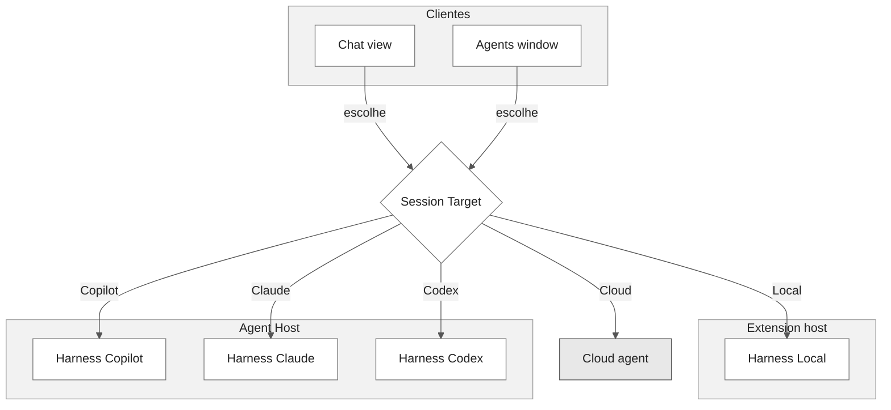
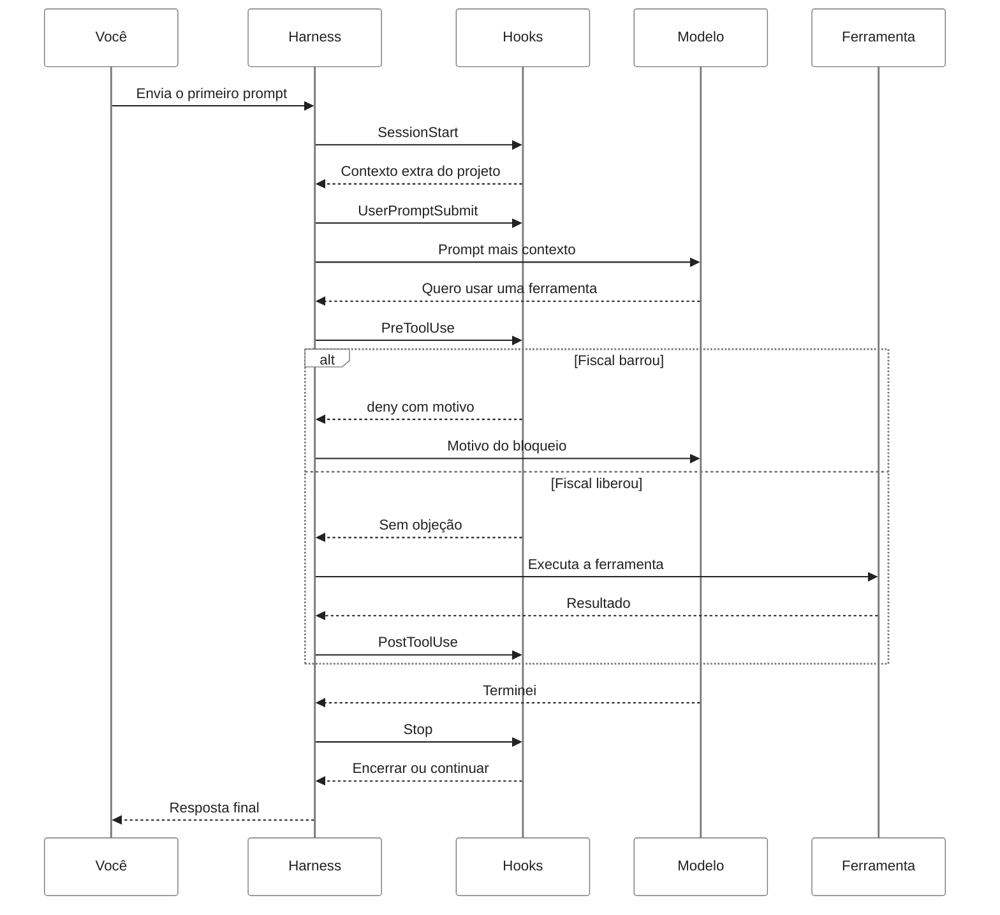
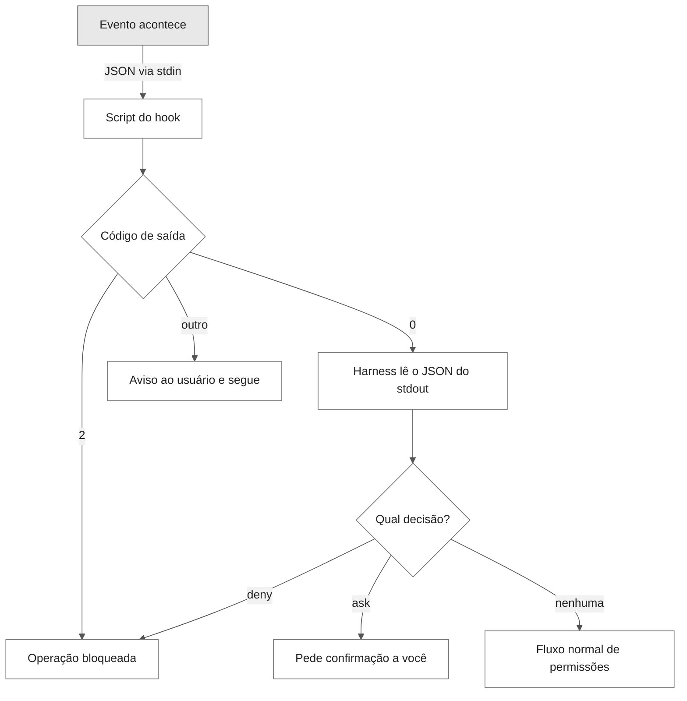
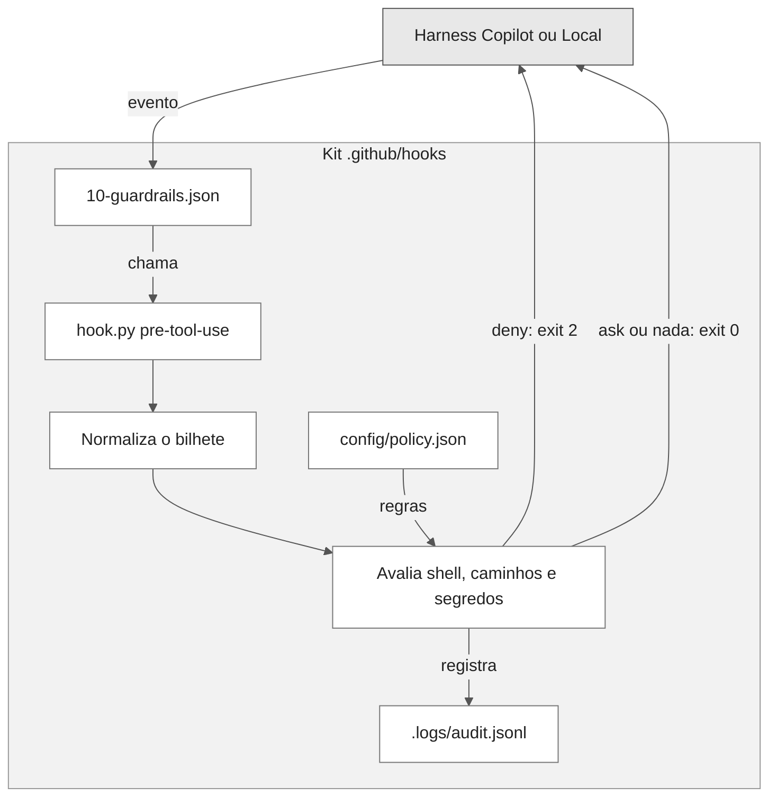
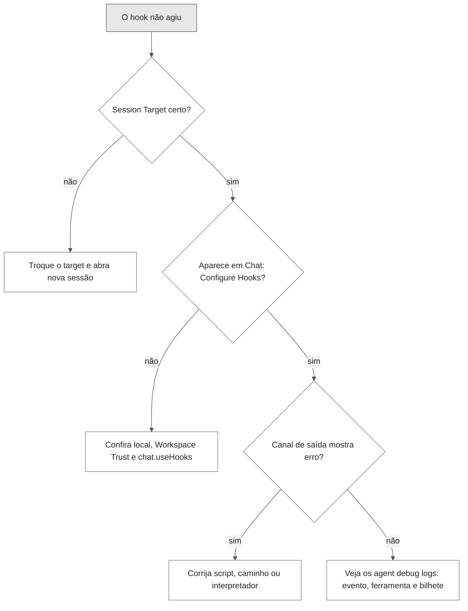

# Hooks do GitHub Copilot: guia didático

Este guia explica, passo a passo e com analogias, o que são hooks, em que momento eles entram em uma sessão de agente, como o harness do Copilot os executa e como o kit desta pasta aplica boas práticas em qualquer projeto.

Quem já conhece o assunto pode ir direto para a [referência técnica do kit](REFERENCIA.md).

## Sumário

- [A ideia em um minuto](#a-ideia-em-um-minuto)
- [As peças do jogo](#as-peças-do-jogo)
- [Hooks e as outras customizações](#hooks-e-as-outras-customizações)
- [Onde o harness roda](#onde-o-harness-roda)
- [A linha do tempo de uma sessão](#a-linha-do-tempo-de-uma-sessão)
- [Como um hook conversa com o harness](#como-um-hook-conversa-com-o-harness)
- [Três cenas do dia a dia](#três-cenas-do-dia-a-dia)
- [Passo a passo: seu primeiro hook](#passo-a-passo-seu-primeiro-hook)
- [Onde os arquivos de hook ficam](#onde-os-arquivos-de-hook-ficam)
- [Hooks só para um agente](#hooks-só-para-um-agente)
- [Como o kit desta pasta funciona](#como-o-kit-desta-pasta-funciona)
- [Trocar de harness sem sustos](#trocar-de-harness-sem-sustos)
- [Quando algo não funciona](#quando-algo-não-funciona)
- [Segurança](#segurança)
- [Mitos rápidos](#mitos-rápidos)
- [Referência do kit](#referência-do-kit)
- [Glossário](#glossário)
- [Referências](#referências)

## A ideia em um minuto

Imagine um **aeroporto**.

- O **piloto** é o agente de IA: ele decide para onde ir e quais equipamentos usar.
- O **aeroporto com sua torre de controle** é o harness: a infraestrutura que opera o voo, entrega as ferramentas ao piloto e registra tudo.
- Os **fiscais nos pontos de controle** (check-in, portão de embarque, pouso) são os hooks: eles não pilotam, mas conferem cada etapa e podem liberar, pedir documentação extra ou barrar.

Um hook é um **programa externo** que o harness chama automaticamente em um momento conhecido da sessão. Ele recebe um "bilhete" em JSON, analisa e devolve um "carimbo" com a decisão.

> [!TIP]
> A diferença mais importante: o piloto pode interpretar mal uma instrução escrita, mas não consegue pular um fiscal. Hooks são **determinísticos** e rodam independentemente do modelo de linguagem.

Não confunda com Git hooks (`pre-commit`) nem com webhooks HTTP. Aqui falamos dos hooks do ciclo de vida de um agente.

## As peças do jogo

| Peça real | No aeroporto | O que faz |
| --- | --- | --- |
| Agente (modelo + instruções) | Piloto | Decide o próximo passo |
| Ferramentas (ler, editar, terminal, MCP) | Equipamentos da aeronave | Executam ações no mundo real |
| Harness | Aeroporto e torre de controle | Conduz a sessão, chama ferramentas e dispara os hooks |
| Session Target | Escolher em qual aeroporto pousar | Define qual harness, e portanto quais regras de hook, valem |
| Evento do ciclo de vida | Ponto de controle | O momento em que um hook roda |
| Descritor `.github/hooks/*.json` | Escala de fiscais | Diz qual fiscal atende cada ponto de controle |
| Script do hook | Fiscal | Lê o bilhete e decide |
| `config/policy.json` | Regulamento do aeroporto | As regras que o fiscal aplica |
| JSON na entrada padrão (stdin) | Bilhete entregue ao fiscal | Dados do evento |
| JSON na saída padrão (stdout) e código de saída | Carimbo do fiscal | A decisão devolvida |
| `.logs/audit.jsonl` | Diário de bordo | Registro do que aconteceu, sem conteúdo sensível |

## Hooks e as outras customizações

Cada customização do Copilot resolve um problema diferente. Hooks não substituem as outras; eles completam.

| Customização | No aeroporto | Quando usar |
| --- | --- | --- |
| Instruções (`copilot-instructions.md`, `*.instructions.md`) | Manual de operações do piloto | Padrões de código, convenções, stack |
| Skills (`SKILL.md`) | Checklists especializados, abertos só quando necessários | Fluxos repetíveis, como escrever requisitos EARS |
| Agentes (`*.agent.md`) | Tripulação especializada | Papéis com instruções e ferramentas próprias |
| **Hooks** | **Fiscais e segurança do aeroporto** | **Regras que precisam valer sempre, sem depender do modelo** |

Regra prática: se a regra pode ser "sugerida", use instruções. Se ela **precisa** ser cumprida, use um hook.

## Onde o harness roda

No VS Code, a janela de chat é só o **cliente**: é onde você vê a conversa. Quem de fato executa a sessão é o **harness** escolhido no controle **Session Target**. Cada harness tem a sua própria implementação de hooks.



| Session Target | Onde roda | Implementação de hooks | Referência |
| --- | --- | --- | --- |
| Local | Extension host do VS Code | Hooks Local do VS Code | [Local hooks reference](https://code.visualstudio.com/docs/agents/reference/hooks-reference) |
| Copilot | Agent Host | SDK do Copilot, a mesma do Copilot CLI | [GitHub Copilot hooks reference](https://docs.github.com/en/copilot/reference/hooks-reference) |
| Claude | Agent Host | Claude Agent SDK | [Claude hooks](https://code.claude.com/docs/en/hooks) |
| Codex | Agent Host ou extensão Codex | Runtime do Codex | [Codex hooks](https://developers.openai.com/codex/hooks/) |
| Cloud | Infraestrutura do provedor | Cloud agent escolhido | Para o Copilot cloud agent, a referência do Copilot |

> [!IMPORTANT]
> Vários harnesses leem o mesmo arquivo `.github/hooks/*.json`, mas isso **não** os torna iguais. Eventos, nomes de ferramentas, formato do bilhete e forma do carimbo podem mudar. É como dois aeroportos que aceitam o mesmo passaporte, mas têm fiscais com regulamentos diferentes.

## A linha do tempo de uma sessão

Pense em um voo completo: check-in, embarque, cada manobra durante o voo e o pouso. Em uma sessão de agente, os pontos de controle são os **eventos**.



Eventos do harness Local do VS Code, com a analogia de cada um:

| Evento | Quando dispara | No aeroporto | Usos comuns |
| --- | --- | --- | --- |
| `SessionStart` | O primeiro prompt inicia a sessão | Check-in | Adicionar contexto do projeto |
| `UserPromptSubmit` | Você envia um prompt | Entrega do plano de voo | Auditar pedidos ou adicionar contexto |
| `PreToolUse` | Antes de o agente usar uma ferramenta | Portão de embarque | Bloquear, pedir aprovação ou ajustar a entrada |
| `PostToolUse` | Depois que a ferramenta termina com sucesso | Conferência após a manobra | Validar resultado, formatar código, registrar |
| `PreCompact` | Antes de compactar o contexto da conversa | Arquivar papéis antigos | Salvar estado que precisa sobreviver |
| `SubagentStart` | Um subagente começa | Copiloto assume o comando | Registrar ou dar contexto ao subagente |
| `SubagentStop` | Um subagente vai terminar | Copiloto devolve o comando | Validar o trabalho do subagente |
| `Stop` | A execução atual vai terminar | Pedido de pouso | Exigir que os testes passem antes de encerrar |

O harness Copilot (CLI, Agent Host e cloud agent) usa nomes em camelCase (`sessionStart`, `preToolUse`, `agentStop`) e tem eventos extras, como `sessionEnd`, `postToolUseFailure`, `permissionRequest` e `errorOccurred`.

> [!NOTE]
> `Stop` não significa "a sessão acabou". Significa "esta execução do agente está prestes a parar". Uma sessão pode ter vários `Stop`.

## Como um hook conversa com o harness

A conversa sempre segue o mesmo ritual, como o fiscal no portão:

1. O harness entrega o **bilhete**: um objeto JSON na entrada padrão (stdin).
2. O hook lê, consulta o regulamento e decide.
3. O hook devolve o **carimbo**: um JSON na saída padrão (stdout) e um **código de saída**.



Um bilhete de `PreToolUse` no formato do harness Local se parece com isto:

```json
{
  "timestamp": "2026-09-24T14:05:00Z",
  "session_id": "sessao-123",
  "hook_event_name": "PreToolUse",
  "tool_name": "read_file",
  "tool_input": { "filePath": ".env" },
  "tool_use_id": "tool-42"
}
```

E um carimbo de negação:

```json
{
  "hookSpecificOutput": {
    "hookEventName": "PreToolUse",
    "permissionDecision": "deny",
    "permissionDecisionReason": "Arquivos .env podem conter segredos."
  }
}
```

Códigos de saída no harness Local:

| Código | Significado |
| --- | --- |
| `0` | Sucesso; o harness processa o JSON do stdout |
| `2` | Erro bloqueante; o texto do stderr é entregue ao modelo |
| Outro | Aviso não bloqueante para o usuário; a sessão continua |

> [!WARNING]
> No harness Copilot, um **timeout** sempre libera a operação (fail-open), inclusive em `preToolUse`. Um fiscal que demora demais é ignorado. Por isso, hooks precisam ser rápidos.

## Três cenas do dia a dia

### Cena 1: o agente tenta ler o `.env`

O agente quer ler `.env` para "entender a configuração". O fiscal `preToolUse` do kit vê que `.env` casa com `secret_paths.patterns` e barra:

```text
Hook de política: acesso a arquivo sensível `.env`.
Se for legítimo, ajuste .github/hooks/config/policy.json.
```

O modelo recebe o motivo e segue por outro caminho, por exemplo lendo `.env.example`, que está nas exceções.

### Cena 2: o agente quer fazer `git push --force`

O comando casa com uma regra `shell.ask`. O fiscal não barra, mas pede sua confirmação. Você decide. No cloud agent, onde não há ninguém para responder, `ask` vira `deny`.

### Cena 3: o agente edita `src/app.js`

Nada casa com as regras. O fiscal fica em silêncio: não devolve decisão nenhuma, e a edição segue o fluxo normal de aprovação do VS Code. O `postToolUse` registra no diário de bordo que houve uma edição, sem guardar o conteúdo.

## Passo a passo: seu primeiro hook

Este exercício vem da documentação do VS Code e mostra o mecanismo em sua forma mais simples: registrar o nome de cada ferramenta antes de o agente usá-la. Faça em um **repositório de testes**, não neste kit.

**Passo 1.** Crie `.github/hooks/audit.json` com a escala do fiscal:

```json
{
  "hooks": {
    "PreToolUse": [
      {
        "type": "command",
        "command": "node .github/hooks/log-tool-use.cjs"
      }
    ]
  }
}
```

**Passo 2.** Crie o fiscal em `.github/hooks/log-tool-use.cjs`:

```javascript
const fs = require('node:fs');

let input = '';
process.stdin.setEncoding('utf8');
process.stdin.on('data', chunk => input += chunk);
process.stdin.on('end', () => {
  const event = JSON.parse(input);
  fs.appendFileSync(
    '.github/hooks/tool-use.log',
    `${event.timestamp} ${event.tool_name}\n`
  );
});
```

**Passo 3.** Selecione **Local** no Session Target, abra uma sessão e peça ao agente uma tarefa que use ferramentas, como "liste os arquivos e leia o README".

**Passo 4.** Abra `.github/hooks/tool-use.log`. Cada linha é um fiscal carimbando um embarque. Esse log também revela os **nomes exatos** das ferramentas do harness Local, úteis para escrever regras.

**Passo 5.** Adicione `tool-use.log` ao `.gitignore`.

> [!TIP]
> Para gerar um hook com IA, digite `/create-hook <descrição>` no chat ou rode **Chat: Generate Hook**. Revise sempre o resultado contra a referência do harness de destino.

Para gerenciar hooks no VS Code, escolha primeiro o Session Target e então abra o editor de customizações: **Configure Chat** (ícone de engrenagem) e **Hooks**, o painel **Customizations** da Agents window ou `/hooks` no chat. O comando **Chat: Configure Hooks** gerencia os arquivos do harness Local.

## Onde os arquivos de hook ficam

Locais que o harness Local descobre:

| Escopo | Local | Observação |
| --- | --- | --- |
| Workspace | `.github/hooks/*.json` | Formato nativo do VS Code ou compatível com o Copilot |
| Workspace, formato Claude | `.claude/settings.json`, `.claude/settings.local.json` | Exige `chat.useClaudeHooks`, desligado por padrão |
| Usuário | `~/.copilot/hooks/*.json` | Vale para todas as sessões Local |
| Usuário, formato Claude | `~/.claude/settings.json` | Exige `chat.useClaudeHooks` |
| Agente customizado | `hooks` no frontmatter do `.agent.md` | Só para aquele agente, só no harness Local |
| Plugin | `hooks.json` ou `hooks/hooks.json` | Depende do formato do plugin |

A execução de hooks Local é controlada por `chat.useHooks` (ligado por padrão), e hooks de workspace respeitam a **Workspace Trust**. Use `chat.hookFilesLocations` para adicionar ou desligar locais.

O harness Local reconhece três formatos de arquivo:

| Formato | Como é reconhecido | Cuidado |
| --- | --- | --- |
| Nativo do VS Code | Eventos em PascalCase, sem campo `version` | Usa `command`, `windows`, `linux`, `osx`, `timeout` |
| Copilot | Campo `version` numérico e eventos em camelCase | O VS Code converte os nomes, mas o bilhete segue o formato Local |
| Claude | `settings.json` dentro de `.claude/` | Os valores de `matcher` são ignorados: todo comando do evento roda |

> [!IMPORTANT]
> Todo `*.json` na raiz de `.github/hooks/` é lido como escala de fiscais. Por isso, neste kit, o regulamento fica em `config/policy.json`, fora da raiz.

## Hooks só para um agente

No harness Local (em Preview), um agente pode trazer seus próprios fiscais no frontmatter. Eles rodam **somente** enquanto aquele agente está ativo, somados aos hooks do workspace e do usuário.

```markdown
---
name: "Formatador rigoroso"
description: "Formata o código depois de cada ferramenta"
hooks:
  PostToolUse:
    - type: command
      command: "./scripts/format-changed-files.sh"
---

Siga as regras de formatação do projeto.
```

Quando esse agente roda como subagente, o `Stop` dele é tratado como `SubagentStop`. É como uma tripulação que leva seu próprio inspetor: ele só trabalha nos voos dessa tripulação.

## Como o kit desta pasta funciona

O kit tem quatro escalas de fiscais que chamam um único fiscal central, `scripts/hook.py`, que lê o regulamento em `config/policy.json`.



O fiscal central tem quatro cuidados:

1. **Fala as duas línguas.** Entende o bilhete do Copilot (`toolName`, `toolArgs`) e o do Local (`tool_name`, `tool_input`), e responde com os campos que os dois esperam.
2. **Nunca carimba "pode passar" por conta própria.** Sem problema encontrado, ele não responde nada, e o fluxo normal de aprovação do VS Code continua valendo.
3. **Na dúvida, barra.** Se o bilhete vier ilegível ou o próprio fiscal falhar antes de uma ferramenta, a resposta é `deny`.
4. **O diário de bordo não guarda segredos.** Registra evento, ferramenta, resultado e regra; nunca argumentos, caminhos ou conteúdo.

| Escala | Evento | O que o fiscal faz |
| --- | --- | --- |
| `10-guardrails.json` | `preToolUse` | Barra, pede confirmação ou fica em silêncio |
| `20-session-context.json` | `sessionStart` | Entrega um resumo do projeto no check-in |
| `30-audit.json` | `postToolUse`, `postToolUseFailure`, `sessionEnd` | Escreve no diário de bordo |
| `40-quality-gate.json` | `agentStop` | Opcional: só autoriza o pouso se os testes passarem |

O regulamento padrão do portão de embarque:

| Situação | Carimbo |
| --- | --- |
| Escrita em `**/.git/**` | `deny` |
| Escrita em `.github/hooks/**` ou `.github/workflows/**` | `ask` |
| Leitura de arquivo sensível (`.env`, `*.pem`, `*.key`, `id_rsa*`, `*.tfstate`, `**/secrets/**`) | `deny` |
| Escrita em arquivo sensível ou comando que o menciona | `ask` |
| Escrita fora do workspace | `ask` |
| Shell catastrófico (`rm -rf /`, `mkfs`, `dd of=/dev/...`, `curl ... \| sh`) | `deny` |
| Shell de alto impacto (`git push`, `git reset --hard`, `rm -rf`, `sudo`, `--no-verify`, `terraform apply`, `DROP TABLE`) | `ask` |
| Qualquer outra coisa | sem carimbo |

Quando há mais de um achado, vale o mais restritivo: `deny` vence `ask`, que vence o silêncio.

## Trocar de harness sem sustos

Antes de mudar o Session Target de um fluxo que usa hooks, confira:

- [ ] O harness de destino descobre o arquivo de hooks.
- [ ] Os eventos e as propriedades de comando existem lá.
- [ ] Os nomes e o formato de entrada das ferramentas batem com os seus filtros.
- [ ] Scripts que leem o transcript do chat continuam funcionando; esse formato não é uma API estável.
- [ ] As decisões (bloquear, adicionar contexto) produzem o efeito esperado.
- [ ] Você sabe onde o comando roda e a quais arquivos e variáveis de ambiente ele tem acesso.

> [!CAUTION]
> Trocar apenas o modelo de linguagem não testa uma migração. Selecione o harness de destino no Session Target e abra uma sessão de teste.

## Quando algo não funciona

Siga o fluxo como uma investigação de aeroporto: primeiro confirme que você está no aeroporto certo, depois que o fiscal está escalado e, por fim, o que ele disse.



Ferramentas de diagnóstico no harness Local:

- **Chat: Configure Hooks** mostra quais arquivos foram descobertos.
- O painel **Output**, canal **GitHub Copilot Chat Hooks**, mostra a saída e os erros dos comandos.
- Os **agent debug logs** mostram nomes de eventos, esquemas de ferramentas, bilhetes e carimbos.
- Se usar formato Claude, ligue `chat.useClaudeHooks` e lembre que o `matcher` é ignorado.
- Aumente o `timeout` só depois de confirmar que o comando está progredindo.

Para harnesses no Agent Host, use o diagnóstico do provedor. As configurações `chat.useHooks`, `chat.hookFilesLocations` e `chat.useClaudeHooks` valem apenas para o harness Local.

## Segurança

Fiscais têm crachá de acesso: hooks executam código com as permissões do processo do harness.

- Trate a configuração e os scripts de hook como código executável e revise-os antes de usar, sobretudo em repositórios compartilhados.
- Exija aprovação antes de o agente editar um script que um hook vai executar depois. Neste kit, `.github/hooks/**` pede confirmação.
- Valide toda entrada JSON antes de usar seus valores em um comando de shell.
- Dê aos comandos apenas o acesso a arquivos, processos e rede de que precisam.
- Guarde credenciais em um cofre aprovado; nunca na configuração, nos scripts, na saída ou no contexto do agente.
- Sua organização pode restringir quais hooks rodam. Consulte o administrador.

## Mitos rápidos

### "O JSON do hook contém a regra"

Não. O descritor é só a escala dos fiscais. A regra está no script e no regulamento (`policy.json`).

### "Código de saída 0 significa liberar"

Não. Significa que o fiscal terminou sem erro. A decisão está no JSON do stdout; se ele estiver vazio, vale o fluxo normal.

### "Um timeout bloqueia por segurança"

Não no harness Copilot: timeout libera. Hooks precisam ser rápidos e nunca podem ser a única barreira.

### "Se funcionou no Local, funciona no Copilot CLI"

Não necessariamente. Eventos, nomes de ferramentas e formato do bilhete mudam. Teste no harness de destino.

### "Regra de regex no shell é uma fronteira de segurança"

É um alarme. Comandos disfarçados escapam. Combine com ferramentas restritas nos agentes, aprovação de terminal e revisão humana.

## Referência do kit

Estrutura, compatibilidade, formato das saídas, chaves de configuração, quality gate, auditoria, verificação e limites estão na [referência técnica do kit](REFERENCIA.md). Regras para criar ou alterar hooks estão em [hooks.instructions.md](../instructions/hooks.instructions.md).

Para conferir rapidamente se o fiscal está funcionando:

```bash
python3 -B -m unittest discover -s .github/hooks/scripts -v
```

## Glossário

| Termo | Significado |
| --- | --- |
| Harness | O motor que conduz a sessão do agente: chama o modelo, as ferramentas e os hooks |
| Session Target | Controle do VS Code que escolhe o harness da sessão |
| Extension host | Processo do VS Code onde roda o harness Local |
| Agent Host | Processo que hospeda os harnesses Copilot, Claude e Codex |
| Evento | Ponto do ciclo de vida em que hooks podem rodar |
| Descritor | Arquivo JSON que liga eventos a comandos |
| Bilhete (payload) | JSON que o harness envia ao hook pela entrada padrão |
| Carimbo (saída) | JSON e código de saída que o hook devolve |
| Fail-closed | Na dúvida, bloqueia |
| Fail-open | Na dúvida, libera |
| Matcher | Filtro que limita um hook a certas ferramentas ou agentes |

## Referências

- [Configure agent hooks in Visual Studio Code](https://code.visualstudio.com/docs/agent-customization/hooks)
- [Local hooks reference (VS Code)](https://code.visualstudio.com/docs/agents/reference/hooks-reference)
- [GitHub Copilot hooks reference](https://docs.github.com/en/copilot/reference/hooks-reference)
- [Using hooks with GitHub Copilot CLI](https://docs.github.com/en/copilot/how-tos/copilot-cli/customize-copilot/use-hooks)
- [Choose and use an agent harness](https://code.visualstudio.com/docs/agents/run/agent-harnesses)
- [Security considerations for AI agents](https://code.visualstudio.com/docs/agents/run/security)
