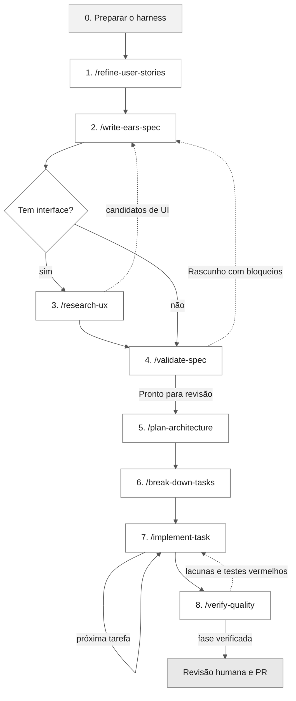

# Ordem de execução dos prompts

Este guia mostra em que ordem executar os prompts de [.github/prompts/](./) e o que o harness do repositório faz em cada etapa: hooks, instruções, agentes e skills. Cada prompt faz uma tarefa, e a saída de uma etapa é a entrada da próxima.

## Como o harness age em cada invocação

Toda execução de prompt passa pelas mesmas camadas, nesta ordem:

| Ordem | Camada | Onde fica | O que faz |
| --- | --- | --- | --- |
| 1 | Hook `sessionStart` | [20-session-context.json](../hooks/20-session-context.json) | Injeta branch, arquivos alterados, especificações em `specs/` e as regras de `session_context.extra` da [política](../hooks/config/policy.json) |
| 2 | Instruções do repositório | [copilot-instructions.md](../copilot-instructions.md) | Stack, comandos, convenções de IDs e fluxo SDD, sempre carregados |
| 3 | Prompt | `.github/prompts/*.prompt.md` | Seleciona o agente (`agent:`), restringe as ferramentas (`tools:`) e define entradas, passos e saída |
| 4 | Agente | [.github/agents/](../agents/) | Missão, limites e definição de pronto do papel |
| 5 | Passo 0 do prompt | [.github/skills/](../skills/) e [.github/instructions/](../instructions/) | Carrega as skills e instruções explicitamente, inclusive as que o `applyTo` não carregaria sozinho |
| 6 | Hook `preToolUse` | [10-guardrails.json](../hooks/10-guardrails.json) | Nega ou pede confirmação para caminhos protegidos, arquivos de segredo, escrita fora do workspace e comandos destrutivos |
| 7 | Hooks `postToolUse` / `sessionEnd` | [30-audit.json](../hooks/30-audit.json) | Auditoria sem conteúdo sensível em `.github/hooks/.logs/` e contagem de escritas da sessão |
| 8 | Hook `agentStop` | [40-quality-gate.json](../hooks/40-quality-gate.json) | Se `quality_gate.enabled` for `true` e a sessão tiver escrito arquivos, roda `quality_gate.commands` e bloqueia o encerramento quando falham (até `max_blocks` vezes) |

> [!NOTE]
> Quando um hook bloquear ou pedir confirmação, não contorne a regra. Explique qual regra disparou e, se a operação for legítima, proponha o ajuste em [policy.json](../hooks/config/policy.json).

## Visão geral do fluxo



## Etapa 0 - Preparar o harness

Faça uma vez por projeto, antes do primeiro prompt:

- [ ] Preencha os marcadores `<...>` de [copilot-instructions.md](../copilot-instructions.md): nome, objetivo, documento de origem, stack, comandos e limites de cobertura. Os prompts `/plan-architecture`, `/implement-task` e `/verify-quality` param e perguntam enquanto stack ou comandos estiverem como marcadores.
- [ ] Confirme que `python3` está disponível, porque todos os hooks chamam [hook.py](../hooks/scripts/hook.py).
- [ ] Revise [policy.json](../hooks/config/policy.json): caminhos protegidos, padrões de segredo e comandos que pedem confirmação.
- [ ] Quando os comandos de lint e testes existirem, ative o quality gate (`quality_gate.enabled: true` e `commands`) para que o `agentStop` bloqueie sessões de construção com gates vermelhos.

## Sequência de execução

| # | Prompt | Agente | Entrada obrigatória | Saída | Critério para avançar |
| --- | --- | --- | --- | --- | --- |
| 1 | [/refine-user-stories](refine-user-stories.prompt.md) | `@requirements-engineer` | `fonte=`, `epico=` | Histórias INVEST e perguntas em aberto (no chat ou em `saida=`) | Histórias com fonte e perguntas encaminhadas ao Product Owner |
| 2 | [/write-ears-spec](write-ears-spec.prompt.md) | `@requirements-engineer` | `feature=`, `fonte=` | `specs/<NNN>-<funcionalidade>/spec.md` | Todo requisito tem `origem:`, aceite e verificação planejada |
| 3 | [/research-ux](research-ux.prompt.md) (só com UI) | `@se-ux-ui-designer` | `feature=`, `fonte=` | `docs/ux/<funcionalidade>-pesquisa.md` | Candidatos de UI levados de volta a `/write-ears-spec` |
| 4 | [/validate-spec](validate-spec.prompt.md) | `@requirements-engineer` | `feature=` | Achados por severidade e status da spec | `spec.md` em `Pronto para revisão` sem bloqueios em P0 |
| 5 | [/plan-architecture](plan-architecture.prompt.md) | `@software-architect` | `feature=` | `plan.md`, `CODEMAP.md`, ADRs `Proposto` | Todo requisito ativo mapeado a componente |
| 6 | [/break-down-tasks](break-down-tasks.prompt.md) | `@software-architect` | `feature=` | `tasks.md` com pares RED/GREEN | Análise cruzada spec-plan-tasks sem órfãos |
| 7 | [/implement-task](implement-task.prompt.md) | `@implementer` | `feature=`, `tarefa=` | Código, testes e evidência datada em `tasks.md` | Gates executados e tarefa marcada com evidência |
| 8 | [/verify-quality](verify-quality.prompt.md) | `@qa-engineer` | `feature=` (`escopo=` opcional) | Matriz requisito-teste, testes novos e gates | Todo P0 coberto por teste que falha com comportamento errado |

## Detalhe por etapa

### 1. Descoberta - `/refine-user-stories`

- **Carrega:** skill `user-story-refine` e instruções de artefatos SDD.
- **Ferramentas:** `read`, `search` e `edit`. Não grava arquivo sem `saida=`.
- **Hooks relevantes:** `preToolUse` nega a leitura de arquivos de segredo e aplica as regras de caminhos protegidos a toda escrita.
- **Repita** quando o Product Owner responder às perguntas em aberto.

### 2. Especificação - `/write-ears-spec`

- **Carrega:** skills `sdd-requirements-engineer` e `tdd-workflow`, instruções de artefatos SDD e de testes, referência EARS e quality gates.
- **Ferramentas:** `read`, `search` e `edit`. Não roda comandos.
- **Saída:** `spec.md` em `Rascunho` ou `Pronto para revisão`. Nunca `Aprovado` sem evidência humana.
- **Repita** para incorporar os candidatos de UI da etapa 3 ou os achados da etapa 4.

### 3. Pesquisa de UX - `/research-ux` (condicional)

- **Quando:** a funcionalidade tem interface (terminal, web ou mobile). Sem interface, pule para a etapa 4.
- **Carrega:** skill `user-story-refine`, instruções de frontend e de plataforma frontend.
- **Handoff:** os requisitos de UI candidatos voltam para `/write-ears-spec`, que atribui os IDs.

### 4. Validação - `/validate-spec`

- **Carrega:** skills SDD e TDD, quality gates, catálogo de antipadrões e referência EARS.
- **Interação:** faz no máximo três perguntas de bloqueio, uma por vez. Responda no chat; a resposta vira fonte `SRC-###`.
- **Saída:** com bloqueio em P0 a spec fica `Rascunho` e volta à etapa 2; sem bloqueios, segue para a etapa 5.

### 5. Design - `/plan-architecture`

- **Pré-condição do harness:** stack e comandos preenchidos em `copilot-instructions.md`.
- **Carrega:** skill SDD, instruções de artefatos SDD, padrão de documentos e Mermaid e modelos de artefatos.
- **Saída:** `plan.md` (`Planejado`), `CODEMAP.md` e, somente para decisões estruturais, ADRs `Proposto` em `docs/adr/`.

### 6. Tarefas - `/break-down-tasks`

- **Carrega:** skills SDD e TDD, instruções de artefatos SDD e de testes, padrão de documentos e Mermaid.
- **Saída:** `tasks.md` com IDs `T001...`, marcadores `[S]`/`[P]`, grafo, mapa de testes e registro de execução com `0 de N`.
- **Repita** sempre que `spec.md` ou `plan.md` mudarem.

### 7. Construção - `/implement-task` (em ciclo)

- **Uma invocação por tarefa ou par RED/GREEN**, na ordem do grafo de `tasks.md`.
- **Carrega:** skill `tdd-workflow`, instruções de testes e de artefatos SDD e, com UI, instruções de frontend e o artefato de `docs/ux/`.
- **Ferramentas:** incluem `execute`. Aqui o harness atua mais:
  - `preToolUse` pede confirmação para `git push`, `rm -rf`, `--no-verify` e outros comandos da política. Também nega a leitura de arquivos de segredo, pede confirmação para escrevê-los, nega escrita em `.git/` e pede confirmação para escrita em `.github/hooks/` e `.github/workflows/`.
  - `postToolUse` conta as escritas da sessão.
  - `agentStop` roda o quality gate, se ativo, e impede o encerramento com lint ou testes vermelhos.
- **Commits:** o prompt sugere a sequência `test:` → `feat:` → `refactor:` e só commita quando o time pede.

### 8. Qualidade - `/verify-quality`

- **Quando:** em paralelo à construção ou ao fim de cada fase de `tasks.md`.
- **Carrega:** instruções de testes, skills TDD e SDD e quality gates.
- **Ferramentas:** incluem `execute` e `playwright/*` para E2E de fluxos críticos de UI.
- **Handoff:** testes vermelhos por comportamento ausente voltam para `/implement-task`.

## Exemplo de sessão completa

```text
/refine-user-stories fonte=requisitos/requisitos.md epico="Fase 1 - versão no terminal"
/write-ears-spec feature=001-sala-do-eco fonte=requisitos/requisitos.md
/research-ux feature=001-sala-do-eco fonte=requisitos/requisitos.md
/write-ears-spec feature=001-sala-do-eco fonte=docs/ux/001-sala-do-eco-pesquisa.md
/validate-spec feature=001-sala-do-eco
/plan-architecture feature=001-sala-do-eco
/break-down-tasks feature=001-sala-do-eco
/implement-task feature=001-sala-do-eco tarefa=T001,T002
/implement-task feature=001-sala-do-eco tarefa=T003,T004
/verify-quality feature=001-sala-do-eco
```

Prefira uma sessão de chat nova por etapa. Assim o `sessionStart` injeta o estado atualizado de `specs/`, e o contador de escritas usado pelo quality gate vale só para a etapa atual.

## Regras que valem para todas as etapas

- Não pule etapas para a frente. Código sem requisito em `spec.md` é rejeitado pelo `@implementer`.
- Status só avança com evidência: `Rascunho` → `Pronto para revisão` → `Aprovado` (decisão humana) → `Implementado` → `Verificado`.
- Perguntas em aberto continuam abertas até o Product Owner responder; nenhum prompt as resolve sozinho.
- Nenhum prompt registra segredos, credenciais ou dados pessoais em artefatos, logs ou evidências.
