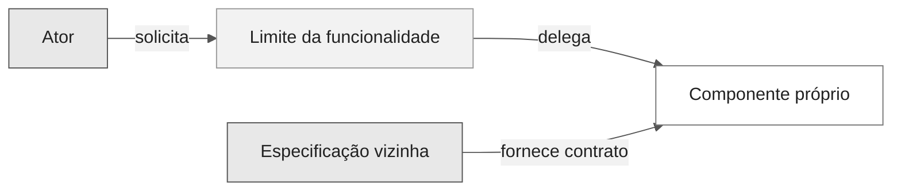
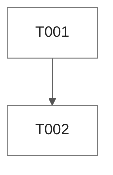

# Modelos de artefatos SDD

Use estes modelos concisos para montar um pacote de Spec-Driven Development completo e rastreável. Declarações de requisitos usam a [notação EARS](./ears-notation.md). Adapte caminhos e nomes às convenções do repositório em vez de criar uma estrutura paralela.

As [instruções de artefatos](../../../instructions/sdd-artifacts.instructions.md) são autoritativas: requisitos e rastreabilidade de fontes ficam em `spec.md`, design e análise em `plan.md`, e mapeamento de testes e evidências de execução em `tasks.md`. Os títulos em maiúsculas abaixo identificam seções reutilizáveis, não arquivos extras obrigatórios.

## Política de artefatos

| Responsabilidade | Onde vive por padrão | Conteúdo |
| --- | --- | --- |
| `CONSTITUTION` | Repositório (`.specify/memory/constitution.md`, `CONSTITUTION.md` ou instruções do repositório) | Princípios inegociáveis, governança e regras de emenda |
| `SPECIFICATION` | `spec.md` | Requisitos EARS normativos, escopo, atores e aceite |
| `ANALYSIS` | `plan.md` | Evidências, lacunas, riscos, alternativas e confiança |
| `DESIGN` | `plan.md` | Arquitetura, dados, interfaces, erros, segurança e trade-offs |
| `TASKS` | `tasks.md` | Tarefas de implementação e validação ordenadas por dependência |
| `TESTING` | `tasks.md` (ou `plan.md` para a estratégia) | Estratégia de testes, catálogo de testes e status de verificação por requisito |
| `CHECKLIST` | `tasks.md` | Gates de revisão e release |
| `CROSS_ANALYSIS` | `plan.md` ou `tasks.md` | Consistência requisito-design-tarefa-verificação |
| `VERIFICATION` | `tasks.md` | Verificações planejadas e evidências executadas |
| `DECISIONS` | `plan.md` ou `docs/adr/` | Decisões relevantes e gatilhos de revisão |
| `SOURCE_TRACEABILITY` | `spec.md` | Proveniência de todo ID de requisito ativo e histórico |

Reutilize uma constituição existente. Crie uma apenas quando o repositório não tiver artefato governante e o escopo solicitado incluir governança.

## Layout sugerido

```text
specs/
  001-nome-da-funcionalidade/
    spec.md
    plan.md
    tasks.md
docs/
  adr/
    0001-titulo-da-decisao.md
```

Registre a aprovação de escopo em um ADR ou decisão vinculada somente quando necessário. Não invente arquivos gerados, checkpoints ou geradores. Preserve especificações existentes e caminhos aprovados.

## CONSTITUTION

```markdown
# Constituição: <Repositório ou Produto>

- Status: Rascunho | Pronto para revisão | Aprovado
- Responsável: <responsável>
- Última revisão: <AAAA-MM-DD ou não-revisado>

## Escopo
<O que esta constituição governa e exclui.>

## Princípios

### CON-001: <Princípio>
- Regra: <regra inegociável>
- Justificativa: <por quê>
- Evidência: <fonte>
- Aplicação: <gate ou revisão>
- Autoridade de exceção: <papel>

## Governança
- Autoridade de aprovação: <papel>
- Processo de emenda: <passos>
- Gatilho de revisão: <evento ou intervalo>
```

## SPECIFICATION (`spec.md`)

```markdown
# Especificação: <Funcionalidade>

- ID da funcionalidade: <NNN ou convenção do repositório>
- Status: Rascunho
- Fontes: <SRC-IDs>
- Constituição: <caminho ou não-aplicável com justificativa>

## Problema e resultado
<Problema, atores e resultado observável desejado.>

## Escopo e não objetivos
- Em escopo: <itens>
- Fora de escopo: <itens>

## Atores e dependências
| Ator ou dependência | Papel | Fonte |
| --- | --- | --- |
| <nome> | <responsabilidade> | SRC-... |

## Registro de fontes
| ID | Classe | Local ou decisão | Data | Autoridade | Notas |
| --- | --- | --- | --- | --- | --- |
| SRC-001 | usuário/repositório/oficial/premissa | <caminho, URL ou decisão> | <data> | <responsável> | <notas> |

## Requisitos

### REQ-001: <Título>
origem: SRC-001

- Padrão: <padrão EARS>
- Prioridade: <P0-P3>
- Status: Proposto
> <Declaração EARS>

**Sinais de aceite**
- AC-REQ-001-01: Dado <contexto>, Quando <ação>, Então <resultado>

**Verificação**
- <método planejado e evidência>

## Premissas, bloqueios e perguntas em aberto
| ID | Tipo | Declaração | Responsável | Impacto |
| --- | --- | --- | --- | --- |
| <ID> | premissa/bloqueio/pergunta | <texto> | <responsável> | <impacto> |

## Disposições históricas
| ID histórico | Última fonte | Disposição | IDs substitutos | Decisão |
| --- | --- | --- | --- | --- |
| <ID> | SRC-... | transferido/substituído/dividido/mesclado/aposentado | <IDs ou nenhum> | <decisão> |
```

## ANALYSIS

```markdown
## Análise

### Inventário de evidências
| ID da fonte | Evidência | Relevância | Confiança |
| --- | --- | --- | --- |
| SRC-001 | <caminho, decisão do usuário ou URL oficial> | <requisitos> | alta/média/baixa |

### Análise de lacunas
| ID | Severidade | IDs afetados | Achado | Resolução |
| --- | --- | --- | --- | --- |
| GAP-001 | bloqueio/alta/média/baixa | REQ-... | <lacuna> | <ação> |

### Opções e trade-offs
| Opção | Benefícios | Custos e riscos | Status da decisão |
| --- | --- | --- | --- |
| <opção> | <benefícios> | <trade-offs> | selecionada/rejeitada/aberta |

### Registro de riscos
| ID | Gatilho | Impacto | Mitigação | Responsável |
| --- | --- | --- | --- | --- |
| RISK-001 | <gatilho> | <impacto> | <mitigação> | <responsável> |
```

## DESIGN (`plan.md`)

````markdown
# Plano: <Funcionalidade>

## Metadados da funcionalidade

| Campo | Valor |
| --- | --- |
| ID da funcionalidade | <NNN> |
| Slug | <slug-kebab> |
| Status | Rascunho |
| Rastreia | <IDs de requisitos> |

## Visão geral da arquitetura
<Componentes, limites e justificativa.>

## Contexto do sistema


## Mapa de componentes
| Componente | Responsabilidade | Interfaces | IDs de requisitos |
| --- | --- | --- | --- |
| <nome> | <responsabilidade> | <contratos> | REQ-..., NFR-... |

## Visão de implantação
<Zonas de runtime, implantação atual, superfícies planejadas e serviços externos.>

## Modelo de estados
<Estados do ciclo de vida, transições, bloqueios e resultados terminais.>

## Sequências críticas
<Sequências de sucesso, negação, falha, retry, rollback e gate humano.>

## Fluxo e ciclo de vida dos dados
<Entidades, propriedade, movimentação, retenção, exclusão e fluxos proibidos.>

## Modelo de dados
| Entidade | Campos-chave | Política de conteúdo | IDs de requisitos |
| --- | --- | --- | --- |
| <nome> | <campos> | <retenção e sensibilidade> | REQ-..., NFR-... |

## Interfaces e contratos
<Entradas, saídas, erros, versionamento, idempotência e compatibilidade.>

## Modelo de erros
| Falha | Detecção | Resposta do sistema | IDs de requisitos |
| --- | --- | --- | --- |
| <falha> | <sinal> | <recuperação ou degradação> | REQ-..., NFR-... |

## Invariantes arquiteturais
| Invariante | Por que se mantém | Onde é garantida |
| --- | --- | --- |
| <invariante> | <motivo> | <caminho> |

## Design de segurança
<Limites de confiança, identidade, autorização, proteção de dados e casos de abuso.>

## Modelo de ameaças
| Ameaça | Vetor | Mitigação | Risco residual |
| --- | --- | --- | --- |
| <ameaça> | <vetor> | <mitigação> | <residual> |

## Estratégia de testes
Nomeie as camadas, o que cada uma prova e onde a evidência é registrada.

## Design de observabilidade
<Correlações, métricas, traces, logs, evidências, redação de dados sensíveis e responsáveis.>

## Superfície de implementação
| Superfície | Estado atual | Mudança planejada |
| --- | --- | --- |
| <caminho ou componente> | existe/parcial/planejado/bloqueado | <delta delimitado> |

## Visão de entrega e rastreabilidade
| Requisitos | Componentes de design | Tarefas ou plano | Dependências | Testes ou evidências | Atual versus alvo |
| --- | --- | --- | --- | --- | --- |
| REQ-..., NFR-... | <componentes> | T001 / P1.1 | <IDs/specs de dependência> | <teste/evidência> | existe/parcial/planejado/bloqueado/alvo |

## Decisões
### DEC-001: <Decisão>
- Status: proposta | aceita | substituída
- Data: <AAAA-MM-DD>
- IDs de requisitos: <IDs>
- Contexto: <motivador da decisão>
- Opções: <alternativas consideradas>
- Decisão: <opção selecionada>
- Consequências: <positivas e negativas>
- Evidência: <fontes>
- Gatilho de revisão: <condição>

## Riscos e trade-offs
<Decisões vinculadas, estado atual, estado parcial, bloqueios, estado alvo, migração e rollback.>

## Desenvolvimento em fases
| Fase | Escopo | Critérios de saída |
| --- | --- | --- |
| P1.1 | <escopo> | <critérios> |

## Histórico de mudanças
| Versão | Data | Mudança |
| --- | --- | --- |
| 0.1.0 | <AAAA-MM-DD> | Design inicial. |
````

Todo bloco Mermaid adicional usa a mesma diretiva de tema universal. Adicione as classes canônicas `default`, `zone` e `external` a diagramas flowchart, graph e class. Diagramas de estado, sequência, ER e gantt herdam o tema sem `classDef`.

## TASKS (`tasks.md`)

````markdown
# Tarefas: <Funcionalidade>

## Metadados da funcionalidade

| Campo | Valor |
| --- | --- |
| ID da funcionalidade | <NNN> |
| Slug | <slug-kebab> |
| Status | Planejado |
| Escopo aprovado | <IDs de requisitos ou não-aprovado> |

## Gate pré-implementação
- [ ] Requisitos estão prontos para revisão ou aprovados conforme a política do repositório.
- [ ] O design cobre todo requisito em escopo.
- [ ] Bloqueios têm responsável e nenhum bloqueio está escondido em uma tarefa.
- [ ] Verificações da constituição passam ou existem exceções aprovadas.

## Regras de execução
- `[S]` significa sequencial.
- `[P]` significa independente em dependências e superfície de mudança.
- RED precede GREEN.
- `[x]` exige evidência de aceite completa e uma entrada correspondente no registro de execução.

## Grafo de dependências


## Mapa de testes
| Tarefa | Testes | IDs de requisitos |
| --- | --- | --- |
| T001 | TST-C001 | REQ-... |
| T002 | TST-C001 | REQ-... |

## Fase 1
- [ ] **T001 [S] [Plano:P1.1] RED** Adicionar o teste de contrato que falha. Rastreia REQ-...
  - Arquivos: `<caminho do teste>`.
  - Aceite: TST-C001 falha pela ausência do comportamento.

- [ ] **T002 [S] [Plano:P1.1] GREEN** Implementar o comportamento mínimo. Rastreia REQ-...
  - Arquivos: `<caminho da implementação>`, `<caminho do teste>`.
  - Aceite: TST-C001 passa com evidência retida.

## Verificação
| ID | Requisito e AC | Método | Ambiente | Resultado esperado | Evidência | Status |
| --- | --- | --- | --- | --- | --- | --- |
| VER-001 | REQ-... / AC-... | teste/inspeção/análise/demonstração/medição | <contexto> | <regra de aprovação> | <caminho ou pendente> | planejado |

## Desvios
| ID | Esperado | Real | Impacto | Decisão |
| --- | --- | --- | --- | --- |
| DEV-001 | <esperado> | <real> | <impacto> | <decisão ou aberta> |

## Gate de conclusão
- [ ] Toda tarefa tem evidência.
- [ ] Nenhum requisito ou teste está órfão.
- [ ] Os resultados de verificação estão registrados na tabela de verificação.

## Registro de execução (<AAAA-MM-DD>)
Tarefas concluídas: **0 de 2**. Nenhuma tarefa é marcada até existir evidência de aceite.
Marcadas como concluídas pela verificação: <nenhuma>

## Histórico de mudanças
| Versão | Data | Mudança |
| --- | --- | --- |
| 0.1.0 | <AAAA-MM-DD> | Conjunto inicial de tarefas. |
````

Use `[P]` apenas quando o grafo de dependências e as superfícies de mudança permitirem trabalho paralelo. Uma tarefa marcada deve aparecer na linha única `Marcadas como concluídas pela verificação: T001, ...` do registro.

## CHECKLIST

```markdown
## Checklist

### Requisitos
- [ ] Verificações EARS passam.
- [ ] Escopo, não objetivos, fontes e prioridades estão explícitos.

### Design
- [ ] Componentes, interfaces, dados, segurança e falhas cobrem os requisitos em escopo.

### Prontidão para implementação
- [ ] Tarefas estão ordenadas por dependência e são rastreáveis.
- [ ] Bloqueios estão resolvidos ou interrompem o handoff explicitamente.

### Verificação e release
- [ ] Verificações planejadas cobrem cada sinal de aceite.
- [ ] Evidências executadas estão vinculadas sem exagerar o status.
```

## CROSS_ANALYSIS

```markdown
## Análise cruzada

| ID do requisito | Fonte | Design | Tarefas | Aceite | Verificação | Resultado |
| --- | --- | --- | --- | --- | --- | --- |
| REQ-001 | SRC-001 | <componente> | T001 | AC-REQ-001-01 | VER-001 | coberto |

### Análise de órfãos
- Requisitos sem cobertura a jusante: <nenhum ou IDs>
- Elementos de design sem requisitos: <nenhum ou IDs>
- Tarefas sem requisitos: <nenhuma ou IDs>
- Verificações sem requisitos: <nenhuma ou IDs>
```

## Artefatos opcionais

- Plano de implementação separado: use quando estratégia, rollout, migração ou sequenciamento entre times precisar de mais detalhe que `tasks.md`.
- Plano de testes separado: use quando ambientes de teste, dados, responsáveis, medição não funcional ou qualificação de release precisarem de plano dedicado.
- Manifesto de testes legível por máquina: use apenas quando a automação do repositório consumir um schema documentado.

## Regras de consistência

- Um ID de requisito ativo tem uma declaração normativa canônica.
- Outros artefatos referenciam o ID e podem resumir sem redefinir.
- Todo requisito ativo tem cobertura de fonte, design, tarefa, aceite e verificação.
- Todo ID histórico tem disposição explícita.
- O status é baseado em evidência: `Rascunho`, `Pronto para revisão`, `Aprovado`, `Implementado` ou `Verificado`.
- Nenhum artefato afirma comportamento atual de sistemas externos sem fonte oficial datada.
