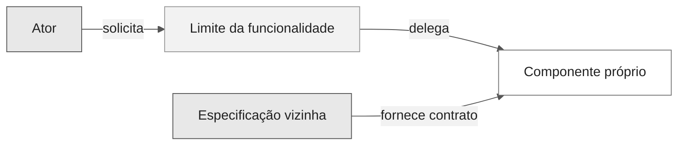
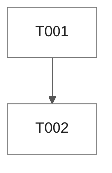

# Modelos de artefatos SDD

Use estes modelos para montar cada pacote de Spec-Driven Development em `.spec/<NNN>-<funcionalidade>/`. Declarações de requisitos usam a [notação EARS](./ears-notation.md). As [instruções de artefatos](../../../instructions/sdd-artifacts.instructions.md) são autoritativas sobre a estrutura, a etapa dona de cada arquivo e a regra de completude.

## Estrutura obrigatória do pacote

Todo pacote tem exatamente esta estrutura, criada inteira por `/write-ears-spec`:

```text
CONSTITUTION.md                      (raiz do repositório)
CODEMAP.md                           (raiz do repositório)
.spec/
  README.md                          (índice de funcionalidades)
  001-nome-da-funcionalidade/
    checkpoints/
      README.md
      spec-to-plan.yaml
      plan-to-tasks.yaml
      test-coverage.yaml
    contracts/
      README.md
      manifest.yaml
      <contrato>.md
    evidence/
      README.md
      <AAAA-MM-DD>-<assunto>.md
    ANALYSIS.md
    CHECKLIST.md
    CROSS_ANALYSIS.md
    DECISIONS.md
    DESIGN.md
    FRD.md
    NFRD.md
    SOURCE_TRACEABILITY.md
    SPECIFICATION.md
    TASKS.md
    TDD.md
    TESTING.md
    VERIFICATION.md
docs/
  adr/0001-titulo-da-decisao.md
  ux/001-nome-da-funcionalidade-pesquisa.md
```

| Arquivo ou pasta | Etapa dona | Conteúdo |
| --- | --- | --- |
| `SPECIFICATION.md` | `/write-ears-spec` | Declarações EARS canônicas, escopo, atores, aceite e verificação planejada |
| `SOURCE_TRACEABILITY.md` | `/write-ears-spec` | Registro de fontes, matriz de rastreabilidade, cobertura da fonte e disposições históricas |
| `FRD.md` | `/write-ears-spec` | [Modelo de FRD](./frd-template.md): escopo funcional por ID |
| `NFRD.md` | `/write-ears-spec` | [Modelo de NFRD](./nfrd-template.md): aplicabilidade e envelopes de medição |
| `ANALYSIS.md` | `/plan-architecture` | Evidências, lacunas, opções e riscos |
| `DESIGN.md` | `/plan-architecture` | Portfólio de design completo e visão de entrega |
| `DECISIONS.md` | `/plan-architecture` | Decisões `DEC-NNN` e ADRs vinculados |
| `contracts/` | `/plan-architecture` | Contratos de interface e `manifest.yaml` |
| `checkpoints/spec-to-plan.yaml` | `/plan-architecture` | Mapa requisito → componente |
| `TASKS.md` | `/break-down-tasks` | Tarefas RED/GREEN ordenadas, grafo e registro de execução |
| `TESTING.md` | `/break-down-tasks` | Estratégia, catálogo e mapa de testes |
| `TDD.md` | `/break-down-tasks` | Ciclo RED/GREEN/REFACTOR planejado por critério de aceite |
| `CHECKLIST.md` | `/break-down-tasks` | Gates de revisão, implementação, verificação e release |
| `CROSS_ANALYSIS.md` | `/break-down-tasks` | Consistência entre todos os arquivos e análise de órfãos |
| `VERIFICATION.md` | `/break-down-tasks`; resultados por `/implement-task` e `/verify-quality` | Verificações planejadas, execuções de validadores e resultados |
| `checkpoints/plan-to-tasks.yaml`, `checkpoints/test-coverage.yaml` | `/break-down-tasks`; atualizados por `/verify-quality` | Mapa plano → tarefas e requisito → testes |
| `evidence/` | `/implement-task`, `/verify-quality` | Evidências datadas e sem dados sensíveis |

## Cabeçalho comum e arquivos de etapas futuras

Todo arquivo começa com o mesmo cabeçalho. Quando `/write-ears-spec` cria o pacote, os arquivos de etapas futuras recebem apenas o cabeçalho, com `Status: Não iniciado`; a etapa dona substitui o conteúdo pelo modelo completo.

```markdown
# DESIGN: <Funcionalidade>

- Funcionalidade: <NNN>-<slug>
- Status: Não iniciado
- Etapa dona: /plan-architecture
```

Status permitidos: `Não iniciado`, `Rascunho`, `Pronto para revisão`, `Planejado`, `Aprovado`, `Implementado`, `Verificado`. Um arquivo produzido contém todas as seções do seu modelo, na ordem do modelo; seções sem conteúdo ficam `NÃO APLICÁVEL: <motivo>`.

## ÍNDICE (`.spec/README.md`)

```markdown
# Especificações

- Fontes: <caminhos dos documentos de origem>
- Última atualização: <AAAA-MM-DD>

## Mapa de funcionalidades
| Pacote | Funcionalidade | Critério de corte | IDs da fonte | Dependências | Status |
| --- | --- | --- | --- | --- | --- |
| [001-slug](001-slug/SPECIFICATION.md) | <nome> | <fase, capacidade ou ator> | RF-01, RF-02 | nenhuma | Rascunho |

## Cobertura da fonte
| ID na fonte | Pacote | Disposição |
| --- | --- | --- |
| RF-01 | 001-slug | derivado |
| RF-07 | nenhum | aposentado na fonte |
```

## CONSTITUTION (`CONSTITUTION.md`)

```markdown
# Constituição: <Repositório ou Produto>

- Status: Rascunho | Pronto para revisão | Aprovado
- Responsável: <responsável>
- Última revisão: <AAAA-MM-DD ou não-revisado>

## Escopo
<O que esta constituição governa e exclui.>

## Princípios

### CON-001: <Princípio>
- Regra: <regra inegociável>
- Justificativa: <por quê>
- Evidência: <fonte>
- Aplicação: <gate ou revisão>
- Autoridade de exceção: <papel>

## Governança
- Autoridade de aprovação: <papel>
- Processo de emenda: <passos>
- Gatilho de revisão: <evento ou intervalo>
```

## SPECIFICATION (`SPECIFICATION.md`)

```markdown
# SPECIFICATION: <Funcionalidade>

- Funcionalidade: <NNN>-<slug>
- Status: Rascunho
- Etapa dona: /write-ears-spec
- Fontes: <SRC-IDs de SOURCE_TRACEABILITY.md>
- Constituição: <caminho>
- Aprovação: PENDENTE

## Problema e resultado
<Problema, atores e resultado observável desejado.>

## Escopo e não objetivos
- Em escopo: <itens>
- Fora de escopo: <itens e pacote que os recebe>

## Atores e dependências
| Ator ou dependência | Papel | Fonte |
| --- | --- | --- |
| <nome> | <responsabilidade> | SRC-... |

## Requisitos

### REQ-001: <Título>
origem: SRC-001 (<caminho#Lx-Ly>)

- IDs da fonte: <RF-..>
- Padrão: <padrão EARS>
- Prioridade: <P0-P3> - <justificativa>
- Status: Proposto
- Justificativa: <motivo>

> <Declaração EARS canônica com `deve`>

**Sinais de aceite**
- AC-REQ-001-01: Dado <contexto>, Quando <ação>, Então <resultado>

**Verificação**
- <método planejado; ciclo em TDD.md>

<Para NFR-NNN, acrescente: `- Envelope de medição: NFRD.md NFR-NNN`.>

## Premissas, bloqueios e perguntas em aberto
| ID | Tipo | Declaração | Evidência | Responsável | Impacto | Status |
| --- | --- | --- | --- | --- | --- | --- |
| <ID> | premissa/bloqueio/pergunta | <texto> | <caminho#Lx> | <responsável> | <impacto> | aberta |

## Validação (<AAAA-MM-DD>)
| Gate | Resultado | Evidência ou motivo |
| --- | --- | --- |
| <G2.01 ...> | PASS/FAIL/BLOQUEADO/NÃO APLICÁVEL | <evidência> |

## Histórico de mudanças
| Versão | Data | Mudança |
| --- | --- | --- |
| 0.1.0 | <AAAA-MM-DD> | Especificação inicial. |
```

## SOURCE_TRACEABILITY (`SOURCE_TRACEABILITY.md`)

```markdown
# SOURCE_TRACEABILITY: <Funcionalidade>

- Funcionalidade: <NNN>-<slug>
- Status: Rascunho
- Etapa dona: /write-ears-spec

## Registro de fontes
| ID | Classe | Local ou decisão | Data | Autoridade | Notas |
| --- | --- | --- | --- | --- | --- |
| SRC-001 | usuário/repositório/oficial/premissa | <caminho, URL ou decisão> | <data> | <responsável> | <notas> |

## Matriz de rastreabilidade
| REQ-ID | Padrão EARS | origem | SRC-ID | ID na fonte | AC-ID | Verificação | Estado |
| --- | --- | --- | --- | --- | --- | --- | --- |
| REQ-001 | <padrão> | <caminho#linhas> | SRC-001 | RF-01 | AC-REQ-001-01 | <método> | Proposto |

## Cobertura da fonte
| ID na fonte | Disposição | IDs neste pacote ou pacote de destino | Motivo |
| --- | --- | --- | --- |
| RF-01 | derivado/dividido/transferido/adiado/bloqueado/aposentado | REQ-001 ou 002-slug | <motivo> |

## Disposições históricas
| ID histórico | Última fonte | Disposição | IDs substitutos | Decisão |
| --- | --- | --- | --- | --- |
| <ID> | SRC-... | transferido/substituído/dividido/mesclado/aposentado | <IDs ou nenhum> | <decisão> |

## Histórico de mudanças
| Versão | Data | Mudança |
| --- | --- | --- |
| 0.1.0 | <AAAA-MM-DD> | Rastreabilidade inicial. |
```

## ANALYSIS (`ANALYSIS.md`)

```markdown
# ANALYSIS: <Funcionalidade>

- Funcionalidade: <NNN>-<slug>
- Status: Rascunho
- Etapa dona: /plan-architecture

## Inventário de evidências
| ID da fonte | Evidência | Relevância | Confiança |
| --- | --- | --- | --- |
| SRC-001 | <caminho, decisão do usuário ou URL oficial> | <requisitos> | alta/média/baixa |

## Análise de lacunas
| ID | Severidade | IDs afetados | Achado | Resolução |
| --- | --- | --- | --- | --- |
| GAP-001 | bloqueio/alta/média/baixa | REQ-... | <lacuna> | <ação> |

## Opções e trade-offs
| Opção | Benefícios | Custos e riscos | Status da decisão |
| --- | --- | --- | --- |
| <opção> | <benefícios> | <trade-offs> | selecionada/rejeitada/aberta |

## Registro de riscos
| ID | Gatilho | Impacto | Mitigação | Responsável |
| --- | --- | --- | --- | --- |
| RISK-001 | <gatilho> | <impacto> | <mitigação> | <responsável> |

## Histórico de mudanças
| Versão | Data | Mudança |
| --- | --- | --- |
| 0.1.0 | <AAAA-MM-DD> | Análise inicial. |
```

## DESIGN (`DESIGN.md`)

````markdown
# DESIGN: <Funcionalidade>

- Funcionalidade: <NNN>-<slug>
- Status: Rascunho
- Etapa dona: /plan-architecture

## Visão geral da arquitetura
<Componentes, limites e justificativa.>

## Contexto do sistema


## Mapa de componentes
| Componente | Responsabilidade | Interfaces | IDs de requisitos |
| --- | --- | --- | --- |
| <nome> | <responsabilidade> | <contrato em contracts/> | REQ-..., NFR-... |

## Visão de implantação
<Zonas de runtime, implantação atual, superfícies planejadas e serviços externos.>

## Modelo de estados
<Estados do ciclo de vida, transições, bloqueios e resultados terminais.>

## Sequências críticas
<Sequências de sucesso, negação, falha, retry, rollback e gate humano.>

## Fluxo e ciclo de vida dos dados
<Entidades, propriedade, movimentação, retenção, exclusão e fluxos proibidos.>

## Modelo de dados
| Entidade | Campos-chave | Política de conteúdo | IDs de requisitos |
| --- | --- | --- | --- |
| <nome> | <campos> | <retenção e sensibilidade> | REQ-..., NFR-... |

## Interfaces e contratos
<Resumo das interfaces; o contrato detalhado vive em `contracts/` e é declarado em `contracts/manifest.yaml`.>

## Modelo de erros
| Falha | Detecção | Resposta do sistema | IDs de requisitos |
| --- | --- | --- | --- |
| <falha> | <sinal> | <recuperação ou degradação> | REQ-..., NFR-... |

## Invariantes arquiteturais
| Invariante | Por que se mantém | Onde é garantida |
| --- | --- | --- |
| <invariante> | <motivo> | <caminho> |

## Design de segurança
<Limites de confiança, identidade, autorização, proteção de dados e casos de abuso.>

## Modelo de ameaças
| Ameaça | Vetor | Mitigação | Risco residual |
| --- | --- | --- | --- |
| <ameaça> | <vetor> | <mitigação> | <residual> |

## Design de observabilidade
<Correlações, métricas, traces, logs, evidências, redação de dados sensíveis e responsáveis.>

## Superfície de implementação
| Superfície | Estado atual | Mudança planejada |
| --- | --- | --- |
| <caminho ou componente> | existe/parcial/planejado/bloqueado | <delta delimitado> |

## Visão de entrega e rastreabilidade
| Requisitos | Componentes de design | Tarefas ou plano | Dependências | Testes ou evidências | Atual versus alvo |
| --- | --- | --- | --- | --- | --- |
| REQ-..., NFR-... | <componentes> | P1.1 | <IDs/pacotes de dependência> | <teste/evidência> | existe/parcial/planejado/bloqueado/alvo |

## Riscos e trade-offs
<Decisões vinculadas (DECISIONS.md), estado atual, parcial, bloqueios, alvo, migração e rollback.>

## Desenvolvimento em fases
| Fase | Escopo | Critérios de saída |
| --- | --- | --- |
| P1.1 | <escopo> | <critérios> |

## Histórico de mudanças
| Versão | Data | Mudança |
| --- | --- | --- |
| 0.1.0 | <AAAA-MM-DD> | Design inicial. |
````

Todo bloco Mermaid usa a mesma diretiva de tema universal. Adicione as classes canônicas `default`, `zone` e `external` a diagramas flowchart, graph e class. Diagramas de estado, sequência, ER e gantt herdam o tema sem `classDef`.

## DECISIONS (`DECISIONS.md`)

```markdown
# DECISIONS: <Funcionalidade>

- Funcionalidade: <NNN>-<slug>
- Status: Rascunho
- Etapa dona: /plan-architecture

## Registro de decisões

### DEC-001: <Decisão>
- Status: proposta | aceita | substituída
- Data: <AAAA-MM-DD>
- IDs de requisitos: <IDs>
- Contexto: <motivador da decisão>
- Opções: <alternativas consideradas>
- Decisão: <opção selecionada>
- Consequências: <positivas e negativas>
- Evidência: <fontes>
- Gatilho de revisão: <condição>
- ADR: <docs/adr/NNNN-slug.md (Proposto) ou não necessário>

## ADRs vinculados
| ADR | Status | Decisões | IDs de requisitos |
| --- | --- | --- | --- |
| <docs/adr/NNNN-slug.md> | Proposto | DEC-001 | REQ-... |

## Histórico de mudanças
| Versão | Data | Mudança |
| --- | --- | --- |
| 0.1.0 | <AAAA-MM-DD> | Decisões iniciais. |
```

## TASKS (`TASKS.md`)

````markdown
# TASKS: <Funcionalidade>

- Funcionalidade: <NNN>-<slug>
- Status: Planejado
- Etapa dona: /break-down-tasks
- Escopo aprovado: <IDs de requisitos ou não-aprovado>

## Gate pré-implementação
- [ ] Requisitos estão prontos para revisão ou aprovados conforme a política do repositório.
- [ ] O design cobre todo requisito em escopo.
- [ ] Bloqueios têm responsável e nenhum bloqueio está escondido em uma tarefa.
- [ ] Verificações da constituição passam ou existem exceções aprovadas.

## Regras de execução
- `[S]` significa sequencial.
- `[P]` significa independente em dependências e superfície de mudança.
- RED precede GREEN; o ciclo de cada critério está em `TDD.md`.
- `[x]` exige evidência de aceite em `evidence/` e uma entrada correspondente no registro de execução.

## Grafo de dependências


## Fase 1
- [ ] **T001 [S] [Plano:P1.1] RED** Adicionar o teste de contrato que falha. Rastreia REQ-...
  - Arquivos: `<caminho do teste>`.
  - Aceite: TST-C001 falha pela ausência do comportamento.

- [ ] **T002 [S] [Plano:P1.1] GREEN** Implementar o comportamento mínimo. Rastreia REQ-...
  - Depende de: T001.
  - Arquivos: `<caminho da implementação>`, `<caminho do teste>`.
  - Aceite: TST-C001 passa com evidência em `evidence/`.

## Desvios
| ID | Esperado | Real | Impacto | Decisão |
| --- | --- | --- | --- | --- |
| DEV-001 | <esperado> | <real> | <impacto> | <decisão ou aberta> |

## Gate de conclusão
- [ ] Toda tarefa tem evidência.
- [ ] Nenhum requisito ou teste está órfão (`CROSS_ANALYSIS.md`).
- [ ] Os resultados estão registrados em `VERIFICATION.md`.

## Registro de execução (<AAAA-MM-DD>)
Tarefas concluídas: **0 de 2**. Nenhuma tarefa é marcada até existir evidência de aceite.
Marcadas como concluídas pela verificação: nenhuma

## Histórico de mudanças
| Versão | Data | Mudança |
| --- | --- | --- |
| 0.1.0 | <AAAA-MM-DD> | Conjunto inicial de tarefas. |
````

Use `[P]` apenas quando o grafo de dependências e as superfícies de mudança permitirem trabalho paralelo. Uma tarefa marcada deve aparecer na linha única `Marcadas como concluídas pela verificação: T001, ...` do registro.

## TESTING (`TESTING.md`)

```markdown
# TESTING: <Funcionalidade>

- Funcionalidade: <NNN>-<slug>
- Status: Planejado
- Etapa dona: /break-down-tasks

## Estratégia de testes
| Camada | O que prova | Ferramenta | Onde fica a evidência |
| --- | --- | --- | --- |
| unidade/contrato/integração/E2E | <comportamento> | <comando de copilot-instructions.md> | evidence/ |

## Ambientes e dados de teste
<Ambientes, dados sintéticos e restrições; nunca dados pessoais reais.>

## Catálogo de testes
| ID | Requisito e AC | Camada | Arquivo | Status |
| --- | --- | --- | --- | --- |
| TST-C001 | REQ-001 / AC-REQ-001-01 | contrato | <caminho> | planejado |

## Mapa de testes
| Tarefa | Testes | IDs de requisitos |
| --- | --- | --- |
| T001 | TST-C001 | REQ-001 |

## Cobertura e limites
<Limites do projeto (linhas/branches), requisitos sem teste automatizado e o método alternativo.>

## Histórico de mudanças
| Versão | Data | Mudança |
| --- | --- | --- |
| 0.1.0 | <AAAA-MM-DD> | Plano de testes inicial. |
```

## TDD (`TDD.md`)

```markdown
# TDD: <Funcionalidade>

- Funcionalidade: <NNN>-<slug>
- Status: Planejado
- Etapa dona: /break-down-tasks

## Regras do ciclo
- Um critério de aceite por ciclo; RED antes de GREEN; REFACTOR com testes verdes.
- Um ciclo planejado não prova execução; o resultado real vai para `VERIFICATION.md` e `evidence/`.

## Ciclos por critério de aceite
| AC-ID | Teste | Entrada | Por que falha antes | Resultado esperado | RED | GREEN | Estado |
| --- | --- | --- | --- | --- | --- | --- | --- |
| AC-REQ-001-01 | TST-C001 | <entrada> | <comportamento ausente> | <saída> | T001 | T002 | planejado |

## Refatorações planejadas
| Alvo | Motivo | Tarefa | Invariante preservada |
| --- | --- | --- | --- |
| <módulo> | <duplicação ou clareza> | T00N | <testes que continuam verdes> |

## Histórico de mudanças
| Versão | Data | Mudança |
| --- | --- | --- |
| 0.1.0 | <AAAA-MM-DD> | Ciclos iniciais. |
```

## CHECKLIST (`CHECKLIST.md`)

```markdown
# CHECKLIST: <Funcionalidade>

- Funcionalidade: <NNN>-<slug>
- Status: Planejado
- Etapa dona: /break-down-tasks

## Requisitos
- [ ] Verificações EARS passam.
- [ ] Escopo, não objetivos, fontes e prioridades estão explícitos.

## Design
- [ ] Componentes, interfaces, dados, segurança e falhas cobrem os requisitos em escopo.

## Prontidão para implementação
- [ ] Tarefas estão ordenadas por dependência e são rastreáveis.
- [ ] Bloqueios estão resolvidos ou interrompem o handoff explicitamente.

## Verificação e release
- [ ] Verificações planejadas cobrem cada sinal de aceite.
- [ ] Evidências executadas estão em `evidence/` sem exagerar o status.

## Histórico de mudanças
| Versão | Data | Mudança |
| --- | --- | --- |
| 0.1.0 | <AAAA-MM-DD> | Checklist inicial. |
```

## CROSS_ANALYSIS (`CROSS_ANALYSIS.md`)

```markdown
# CROSS_ANALYSIS: <Funcionalidade>

- Funcionalidade: <NNN>-<slug>
- Status: Planejado
- Etapa dona: /break-down-tasks

## Análise cruzada
| ID do requisito | Fonte | Design | Tarefas | Aceite | Teste | Verificação | Resultado |
| --- | --- | --- | --- | --- | --- | --- | --- |
| REQ-001 | SRC-001 | <componente> | T001, T002 | AC-REQ-001-01 | TST-C001 | VER-001 | coberto |

## Análise de órfãos
- Requisitos sem cobertura a jusante: <nenhum ou IDs>
- Elementos de design sem requisitos: <nenhum ou IDs>
- Tarefas sem requisitos: <nenhuma ou IDs>
- Testes e verificações sem requisitos: <nenhum ou IDs>

## Consistência entre arquivos
- IDs de `SPECIFICATION.md` ausentes de `FRD.md`, `NFRD.md`, `SOURCE_TRACEABILITY.md`, `DESIGN.md`, `TESTING.md`, `VERIFICATION.md` ou dos checkpoints: <nenhum ou IDs>
- Critérios de aceite sem ciclo em `TDD.md`: <nenhum ou IDs>
- Contagens e status divergentes: <nenhum ou achados>

## Histórico de mudanças
| Versão | Data | Mudança |
| --- | --- | --- |
| 0.1.0 | <AAAA-MM-DD> | Análise cruzada inicial. |
```

## VERIFICATION (`VERIFICATION.md`)

```markdown
# VERIFICATION: <Funcionalidade>

- Funcionalidade: <NNN>-<slug>
- Status: Planejado
- Etapa dona: /break-down-tasks

## Verificações planejadas
| ID | Requisito e AC | Método | Ambiente | Resultado esperado | Status |
| --- | --- | --- | --- | --- | --- |
| VER-001 | REQ-001 / AC-REQ-001-01 | teste/inspeção/análise/demonstração/medição | <contexto> | <regra de aprovação> | planejado |

## Execuções de validadores
| Data | Comando | Código de saída | Resumo | Evidência |
| --- | --- | --- | --- | --- |
| <AAAA-MM-DD> | `python3 -B .github/scripts/validate-sdd.py` | <código> | <erros/avisos> | `evidence/<AAAA-MM-DD>-validate-sdd.md` |

## Resultados
| ID | Data | Resultado | Evidência |
| --- | --- | --- | --- |
| VER-001 | <AAAA-MM-DD> | PASS/FAIL/BLOQUEADO/PENDENTE | `evidence/<arquivo>` |

## Histórico de mudanças
| Versão | Data | Mudança |
| --- | --- | --- |
| 0.1.0 | <AAAA-MM-DD> | Verificação inicial. |
```

## Checkpoints (`checkpoints/`)

Arquivos YAML legíveis por máquina. `feature.id` repete o número do pacote. Todo ID ativo aparece no checkpoint correspondente.

```yaml
# checkpoints/spec-to-plan.yaml
feature: {id: "001", slug: "nome-da-funcionalidade"}
mapping_status: complete   # complete | partial | blocked
requirements:
  REQ-001: {components: ["<componente>"], plan: "P1.1", status: planejado}
```

```yaml
# checkpoints/plan-to-tasks.yaml
feature: {id: "001", slug: "nome-da-funcionalidade"}
gate: {pre_implementation: pendente}
tasks:
  T001: {plan: "P1.1", mode: RED, traces: [REQ-001], depends_on: []}
  T002: {plan: "P1.1", mode: GREEN, traces: [REQ-001], depends_on: [T001]}
```

```yaml
# checkpoints/test-coverage.yaml
feature: {id: "001", slug: "nome-da-funcionalidade"}
requirements:
  REQ-001: {acceptance: [AC-REQ-001-01], tests: [TST-C001], status: planejado}
```

## Contratos (`contracts/`)

`contracts/manifest.yaml` declara cada contrato de interface da funcionalidade (entrada, saída, mensagens, erros, formatos). Quando não houver contrato, declare `nao-aplicavel` com motivo em vez de omitir o manifesto.

```yaml
# contracts/manifest.yaml
feature: {id: "001", slug: "nome-da-funcionalidade"}
contracts:
  cli-io.md: {status: presente, requirements: [REQ-001]}
  # sem contrato: {status: nao-aplicavel, reason: "<motivo>"}
```

## Índices das pastas

Cada pasta (`checkpoints/`, `contracts/`, `evidence/`) tem um `README.md` que lista os arquivos presentes e sua finalidade. `evidence/README.md` também lista cada evidência com data, comando ou origem e o ID verificado. Evidências nunca contêm segredos, credenciais ou dados pessoais.

## Regras de consistência

- Um ID de requisito ativo tem uma declaração normativa canônica, em `SPECIFICATION.md`.
- Os demais arquivos referenciam o ID e podem resumir sem redefinir.
- Todo requisito ativo tem cobertura de fonte, design, tarefa, aceite, ciclo TDD, teste e verificação.
- Todo ID da fonte tem disposição em algum pacote (`SOURCE_TRACEABILITY.md`) e aparece no índice `.spec/README.md`.
- O status é baseado em evidência; nenhum artefato afirma comportamento atual de sistemas externos sem fonte oficial datada.
